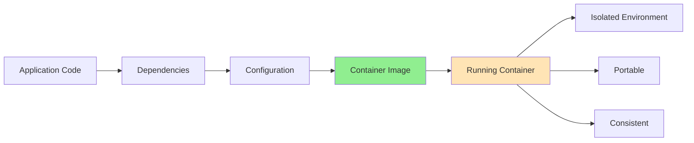
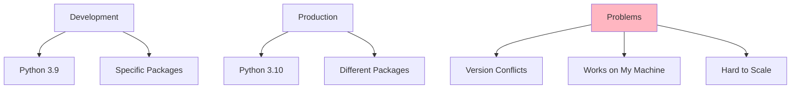
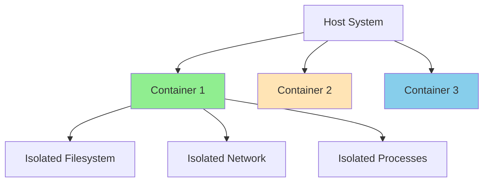
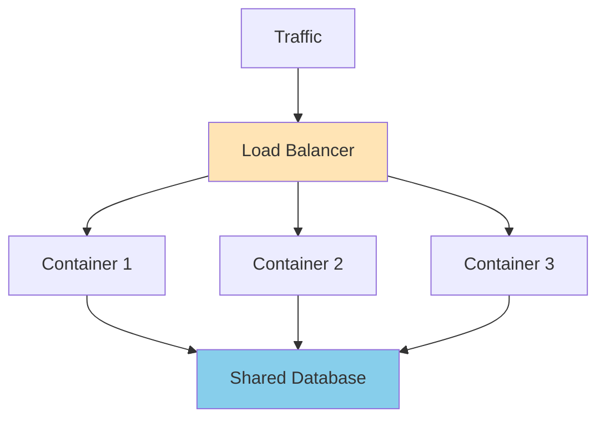

# Baby Tools Shop

Containerize an e-commerce application for baby products. Discover how systems can be operated in isolated environments and understand the advantages this provides for scaling and operating systems.

import GithubLinkAdmonition from '@site/src/components/GithubLinkAdmonition';

<GithubLinkAdmonition 
    link="https://github.com/4gh0rn/baby-tools-shop"
    title="GitHub Repository" 
    type="tip"
>
View the complete source code and Docker configuration on GitHub
</GithubLinkAdmonition>

## Project Goal

**Containerize an e-commerce application for baby products.** The project focuses on:
- **Isolation**: Running applications in isolated environments
- **Scalability**: Understanding how containers enable horizontal scaling
- **Operational Benefits**: Simplified deployment, updates, and maintenance

## Prerequisites

### Required Knowledge
- Basic understanding of web applications
- Familiarity with command line
- Basic Python/Django knowledge (helpful but not required)

### Required Software
- **Docker**: Containerization platform
- **Docker Compose**: Container orchestration tool
- **Git**: Version control

### System Requirements
- Operating system with Docker support (Linux, macOS, Windows)
- Minimum 2GB RAM
- Internet connection for downloading images

## Conceptual Overview

### What is Containerization?

Containerization packages an application with all its dependencies into a **container** - an isolated environment that runs consistently anywhere:



### Core Concepts

**Isolation** - Each container runs in its own isolated environment:
- **Process Isolation**: Containers can't see each other's processes
- **Filesystem Isolation**: Each container has its own file system
- **Network Isolation**: Containers have separate network namespaces
- **Resource Isolation**: CPU and memory can be limited per container

**Portability** - "Build once, run anywhere":
- Same container runs on any Docker host
- No environment-specific configuration needed
- Consistent behavior across development, staging, and production

**Scalability** - Run multiple container instances:
- **Horizontal Scaling**: Deploy multiple identical containers
- **Load Distribution**: Share traffic across instances
- **High Availability**: If one container fails, others continue

## The Challenge

### Traditional Deployment Problems

Without containers, deploying applications faces challenges:



**Common Issues:**
- Different Python versions between environments
- Package conflicts and dependency hell
- Configuration differences
- Difficult to replicate exact environment
- Hard to scale horizontally

## The Solution: Containerization

### Isolation Benefits

Containers provide **process isolation** - each container is isolated from others:



**Benefits:**
- **No Conflicts**: Different applications can use different Python versions
- **Security**: Containers can't access each other's files
- **Clean Environment**: No leftover files from previous deployments
- **Resource Control**: Limit CPU/memory per container

### Scalability with Containers

Containerization enables **horizontal scaling** - running multiple instances:



**Scaling Example:**
```bash
# Start with 1 container
docker-compose up -d

# Scale to 3 containers
docker-compose up -d --scale web=3

# Each container handles portion of traffic
# If one fails, others continue serving
```

**Advantages:**
- **Handle More Traffic**: Multiple containers = more capacity
- **High Availability**: If one container fails, others continue
- **Easy Scaling**: Add/remove containers as needed
- **Load Distribution**: Traffic automatically distributed

### Operational Benefits

**Deployment:**
- One command deploys entire application: `docker-compose up -d`
- Same deployment process everywhere
- Easy rollback to previous version

**Updates:**
- Update containers without affecting host system
- Zero-downtime updates possible
- Quick rollback if issues occur

**Maintenance:**
- Isolated changes - updates don't affect other applications
- Easy cleanup - remove container, no leftover files
- Resource management - limit resources per container

## Scaling the Application

### Scale Horizontally

**Single Container (Default):**
```bash
docker-compose -f docker-compose.prod.yml up -d
```

**Multiple Containers:**
```bash
# Scale to 3 instances
docker-compose -f docker-compose.prod.yml up -d --scale web=3

# Verify running instances
docker-compose -f docker-compose.prod.yml ps
```

**Benefits:**
- **3x Capacity**: Handle 3x more concurrent requests
- **Fault Tolerance**: If one fails, others continue
- **Load Distribution**: Traffic shared across instances

### Resource Monitoring

```bash
# View resource usage
docker stats

# View specific container
docker stats baby-tools-shop-web-1
```

## Learning Outcomes

### Containerization Concepts
- **Isolation**: Understanding process, filesystem, and network isolation
- **Portability**: "Build once, run anywhere" principle
- **Scalability**: Horizontal scaling with multiple container instances
- **Resource Efficiency**: Containers vs. virtual machines

### Operational Benefits
- **Deployment**: One-command deployment process
- **Updates**: Zero-downtime updates and easy rollbacks
- **Maintenance**: Isolated changes and easy cleanup
- **Monitoring**: Container metrics and health checks

### Best Practices
- **Environment Configuration**: Use environment variables for secrets
- **Container Optimization**: Use slim base images
- **Automated Startup**: Entrypoint scripts for consistency
- **Resource Limits**: Set CPU/memory limits for containers
- **Health Checks**: Monitor container health

## Tips and Tricks

### Development Tips

**1. Hot Reload (Development):**
For development, mount volumes for code changes:
```yaml
services:
  web:
    volumes:
      - ./babyshop_app:/app/babyshop_app
```

**2. Environment Variables:**
Always use `.env` file for configuration:
```bash
# Never commit .env to Git
echo ".env" >> .gitignore
```

**3. Resource Limits:**
Set limits to prevent resource exhaustion:
```yaml
services:
  web:
    deploy:
      resources:
        limits:
          cpus: '0.5'
          memory: 512M
```

## Further References

- [Docker Documentation](https://docs.docker.com/)
- [Docker Compose Documentation](https://docs.docker.com/compose/)
- [Django Documentation](https://docs.djangoproject.com/)
