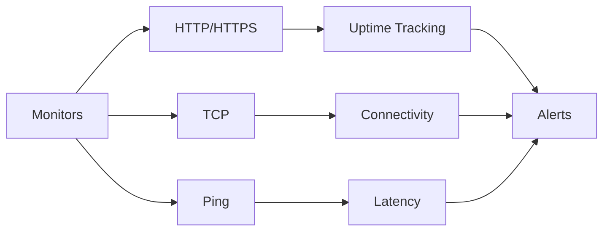
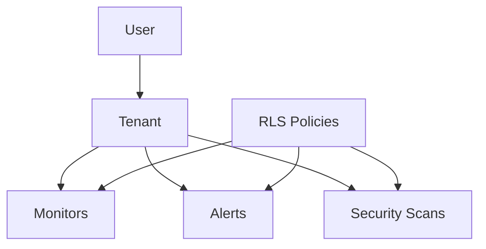
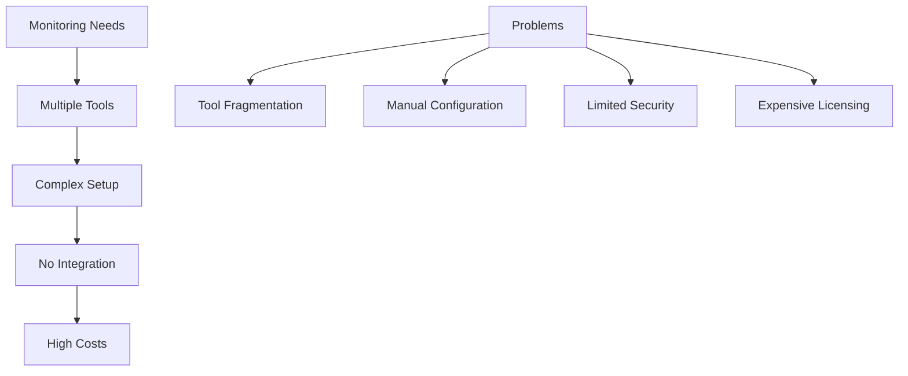
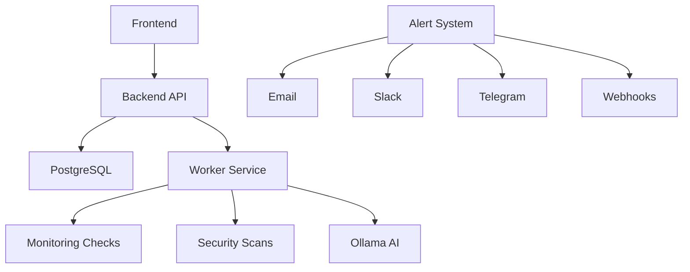

# Monitoring Platform

Modern multi-tenant monitoring platform for comprehensive infrastructure monitoring, security scanning, and alerting. Built with Go, React, and PostgreSQL to provide real-time monitoring, security analysis, and intelligent alerting.

## Project Goal

**Build a comprehensive monitoring platform** that provides:
- **Infrastructure Monitoring**: HTTP/HTTPS, TCP, and Ping monitoring
- **Security Scanning**: SSL/TLS analysis, security headers, secrets detection, vulnerability assessment
- **Multi-Channel Alerting**: Email, Slack, Telegram, and custom webhooks
- **Multi-Tenant Architecture**: Complete tenant isolation with Row-Level Security
- **Real-Time Dashboard**: Live updates and instant notifications

Learn to build **enterprise-grade monitoring systems** with modern technologies and security best practices.

## Prerequisites

### Required Knowledge
- Understanding of monitoring and observability concepts
- Basic knowledge of Go and React
- Familiarity with PostgreSQL
- Understanding of REST APIs and authentication
- Basic knowledge of Docker and Docker Compose

### Required Software
- **Docker**: Containerization platform
- **Docker Compose**: Container orchestration
- **Make**: For build automation (optional)

### System Requirements
- Operating system with Docker support
- Minimum 4GB RAM (8GB+ recommended)
- Ports 3000, 8080, 8081, 8090, 8025 available
- Internet connection

## Conceptual Overview

### What is Infrastructure Monitoring?

Infrastructure monitoring involves **continuous observation** of systems and services:

**Key Concepts:**
- **Uptime Monitoring**: Track service availability
- **Performance Metrics**: Response times, latency, packet loss
- **Security Scanning**: SSL certificates, security headers, vulnerabilities
- **Alerting**: Notify when issues are detected

### Multi-Tenant Architecture

The platform uses **Row-Level Security (RLS)** for complete tenant isolation:

**Architecture Benefits:**
- **Complete Isolation**: Each tenant's data is completely separated
- **Scalability**: Support multiple organizations on single instance
- **Security**: Database-level access control
- **Resource Efficiency**: Shared infrastructure, isolated data

## The Challenge

### Traditional Monitoring Limitations

Traditional monitoring solutions face challenges:

**Common Issues:**
- **Tool Fragmentation**: Different tools for different monitoring types
- **Complex Setup**: Time-consuming configuration and integration
- **Limited Security**: Basic monitoring without security scanning
- **High Costs**: Expensive enterprise solutions
- **No Multi-Tenancy**: Separate instances for each organization

## The Solution: Unified Monitoring Platform

### Core Monitoring Features

**HTTP/HTTPS Monitoring:**
- Website availability tracking
- SSL certificate validation and expiration monitoring
- Response time measurement
- Status code verification

**TCP Monitoring:**
- Network service connectivity testing
- Port availability checks
- Connection timeout detection

**Ping Monitoring:**
- Network latency measurement
- Packet loss analysis
- Round-trip time tracking

### Security Scanning

**SSL/TLS Analysis:**
- Certificate validation and expiration tracking
- Cipher strength assessment
- Protocol version verification

**Security Headers:**
- Detection of missing or misconfigured headers
- CSP, HSTS, X-Frame-Options analysis
- Security best practices validation

**Secrets Detection:**
- Identification of exposed API keys
- Credential scanning
- Sensitive information detection

**Vulnerability Assessment:**
- Comprehensive security scanning
- OWASP categorization
- Finding management and prioritization

### Alerting System

**Multi-Channel Notifications:**
- Email notifications
- Slack integration
- Telegram bot support
- Custom webhooks

**Smart Alert Rules:**
- Status-based alerts (up/down)
- Consecutive failure detection
- Performance threshold alerts
- Escalation policies

## Architecture Concepts

### Technology Stack

**Backend:**
- **Go**: High-performance backend with Fiber framework
- **PostgreSQL**: Database with Row-Level Security

**Frontend:**
- **React**: Modern UI with React Router
- **SPA Mode**: Single-page application architecture

**Worker Service:**
- Background processing for monitoring checks
- Security scan execution
- Queue-based job processing

**Optional AI Integration:**
- **Ollama**: AI-powered security analysis
- LLM integration for finding analysis
- Optional feature (works without Ollama)

### Service Architecture

### Multi-Tenant Security

**Row-Level Security (RLS):**
- Database-level access control
- Automatic tenant filtering
- Complete data isolation
- Secure by default

**Authentication:**
- Token-based authentication
- Token refresh mechanism
- 2FA support

## Learning Outcomes

### Monitoring System Development
- **Infrastructure Monitoring**: Building comprehensive monitoring solutions
- **Multi-Tenant Architecture**: Implementing secure tenant isolation
- **Real-Time Updates**: Live dashboard and instant notifications
- **Alerting Systems**: Multi-channel notification infrastructure

### Security Integration
- **Security Scanning**: SSL/TLS, headers, secrets detection
- **Vulnerability Assessment**: OWASP-based security analysis
- **Finding Management**: Track and prioritize security issues
- **AI-Powered Analysis**: Optional LLM integration for security insights

### Full-Stack Development
- **Go Backend**: High-performance API development
- **React Frontend**: Modern UI with real-time updates
- **PostgreSQL**: Database design with RLS
- **Docker**: Containerized deployment

### DevOps Practices
- **CI/CD**: GitLab CI/CD pipeline
- **Container Orchestration**: Docker Compose for development and production
- **Database Migrations**: Schema management and versioning
- **Worker Services**: Background job processing

## Best Practices

### Monitoring Configuration
- **Monitor Types**: Choose appropriate monitor type (HTTP/TCP/Ping)
- **Check Intervals**: Balance between responsiveness and resource usage
- **Alert Rules**: Configure meaningful alert thresholds
- **Multi-Channel**: Use multiple notification channels for redundancy

### Security Scanning
- **Regular Scans**: Schedule periodic security scans
- **Finding Management**: Track and resolve security findings
- **SSL Monitoring**: Monitor certificate expiration dates
- **Header Analysis**: Ensure security headers are properly configured

### Multi-Tenant Management
- **Tenant Isolation**: Verify RLS policies are working correctly
- **Resource Limits**: Monitor resource usage per tenant
- **Access Control**: Implement proper user permissions
- **Data Backup**: Regular backups of tenant data

### Development Workflow
- **Make Commands**: Use Make for all operations
- **Hot Reload**: Development environment with hot reload
- **Testing**: Comprehensive testing before deployment
- **Documentation**: Keep documentation up to date

## Security Disclaimer

### Authorized Use Only

**This monitoring platform is designed for authorized monitoring of systems you own or have explicit permission to monitor.** All monitoring and security scanning activities must comply with applicable laws and regulations.

### Ethical Guidelines
- ✅ Only monitor systems you own or have explicit permission
- ✅ Respect rate limits and system resources
- ✅ Follow responsible disclosure for security findings
- ✅ Protect sensitive monitoring data

### Legal Notice

**Unauthorized monitoring of systems is illegal.** This platform should only be used:
- For monitoring your own infrastructure
- With explicit written permission from system owners
- In authorized penetration testing engagements
- For legitimate security research with proper authorization

**Never use this platform to monitor systems without explicit authorization.**

## Further References

- [Monitoring Best Practices](https://www.datadoghq.com/learn/monitoring/)
- [PostgreSQL Row-Level Security](https://www.postgresql.org/docs/current/ddl-rowsecurity.html)
- [Go Fiber Framework](https://docs.gofiber.io/)
