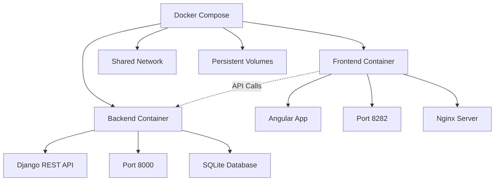
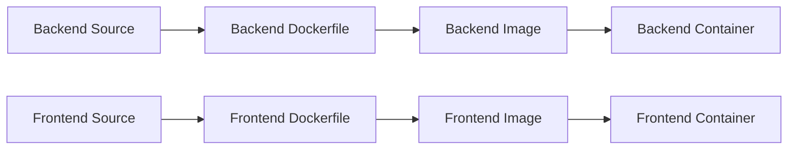
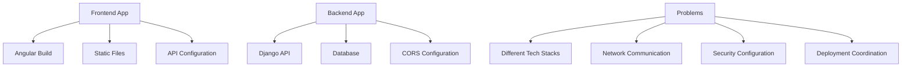
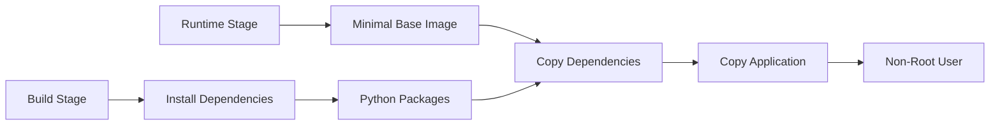
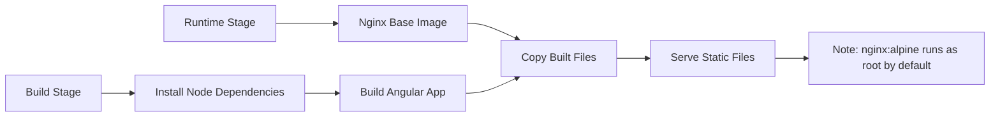
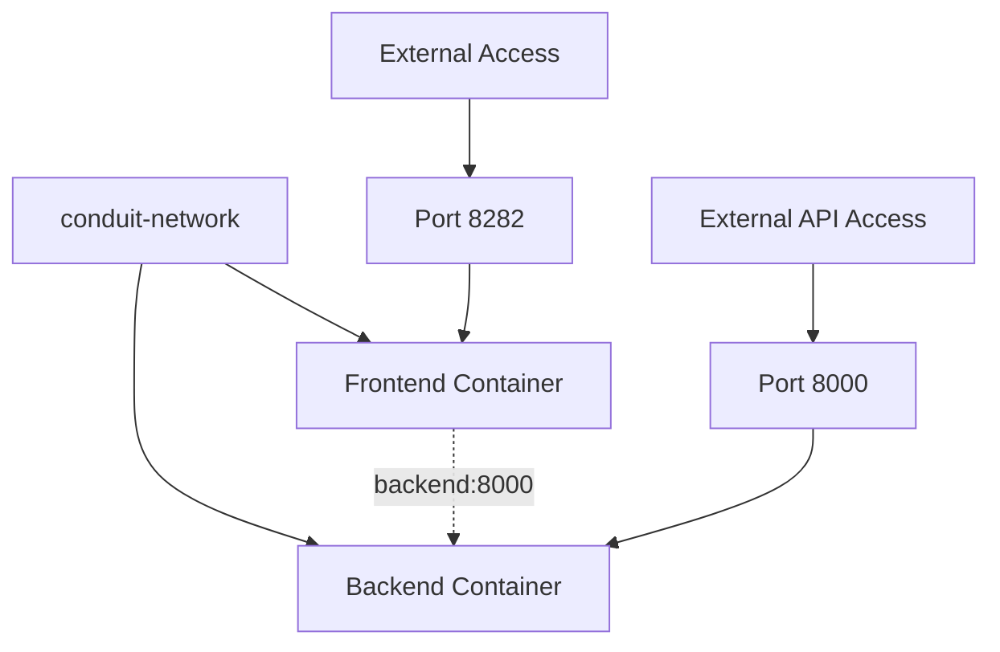
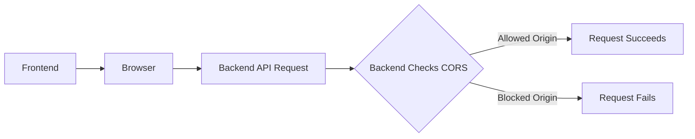
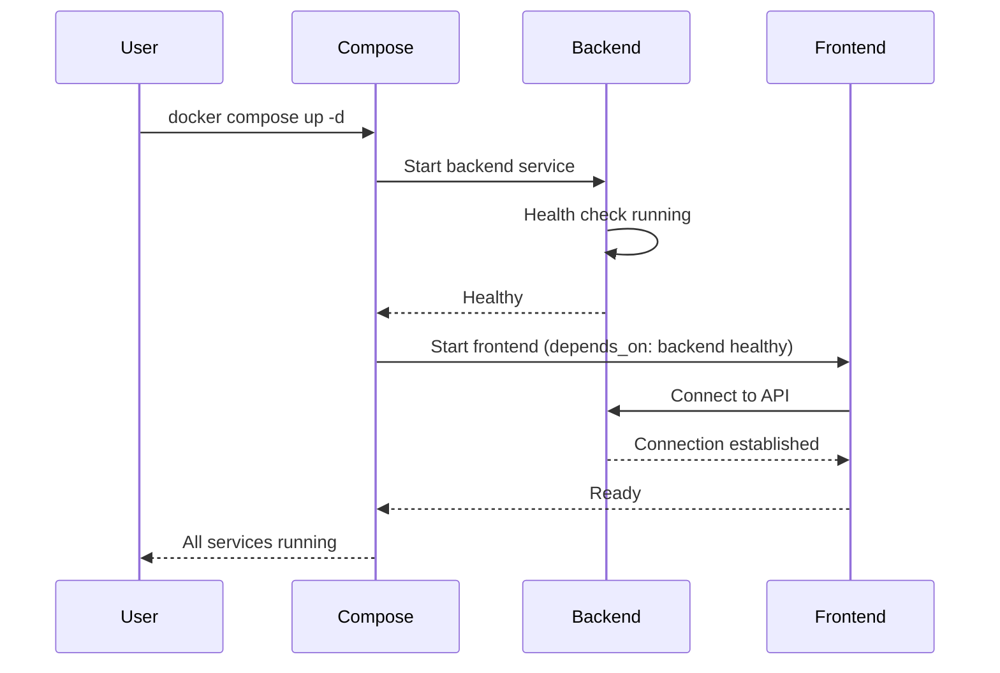
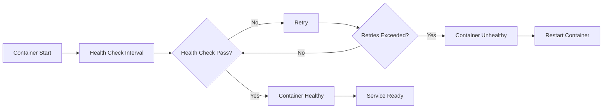

# Conduit Container

Package both a backend and frontend application into appropriate container images and configure them for joint operation in the cloud. Consolidate your knowledge of containers, network technology, and network security.

import GithubLinkAdmonition from '@site/src/components/github-link-admonition';

<GithubLinkAdmonition 
    link="https://github.com/4gh0rn/conduit-container"
    title="GitHub Repository" 
    type="tip"
>
View the complete containerization setup and Docker Compose configuration on GitHub
</GithubLinkAdmonition>

## Project Goal

**Package backend and frontend applications into container images** and configure them for **joint operation in the cloud**:
- **Container Images**: Create optimized images for both backend and frontend
- **Multi-Container Setup**: Configure backend and frontend to work together
- **Network Configuration**: Set up secure container communication
- **Network Security**: Implement CORS, ALLOWED_HOSTS, and security best practices

Consolidate knowledge of **containers**, **network technology**, and **network security**.

## Prerequisites

### Required Knowledge
- Basic understanding of web applications (frontend and backend)
- Familiarity with Docker and Docker Compose
- Basic knowledge of REST APIs
- Understanding of network concepts (helpful but not required)

### Required Software
- **Docker**: Containerization platform (version 20.10 or higher)
- **Docker Compose**: Container orchestration (version 2.0 or higher)
- **Git**: Version control

### System Requirements
- Operating system with Docker support
- Minimum 4GB RAM (for both containers)
- Ports 8000 and 8282 available
- Internet connection for downloading images

## Conceptual Overview

### Multi-Container Architecture

The project demonstrates **packaging separate applications** into containers and orchestrating them:

**Key Concepts:**
- **Separate Containers**: Backend and frontend in different containers
- **Service Communication**: Frontend communicates with backend via network
- **Independent Scaling**: Each service can be scaled independently
- **Technology Isolation**: Different tech stacks in separate containers

### Container Image Creation

Each application is packaged into its own **container image**:

**Image Benefits:**
- **Optimized Builds**: Multi-stage builds reduce image size
- **Reproducible**: Same image runs identically everywhere
- **Version Control**: Images can be tagged and versioned
- **Portable**: Images can be shared via container registry

## The Challenge

### Multi-Application Deployment

Deploying separate frontend and backend applications faces challenges:

**Common Issues:**
- **Different Technologies**: Frontend (Node.js/Angular) and backend (Python/Django) need different environments
- **Network Communication**: Frontend must connect to backend API
- **Security Configuration**: CORS, ALLOWED_HOSTS, and network security
- **Deployment Coordination**: Both applications must be deployed together
- **Configuration Management**: API URLs, environment variables, secrets

## The Solution: Container Orchestration

### Multi-Stage Builds

Both applications use **multi-stage builds** for optimized images:

**Backend Multi-Stage Build:**

**Frontend Multi-Stage Build:**

**Benefits:**
- **Smaller Images**: Only runtime dependencies in final image
- **Faster Deployments**: Less data to transfer
- **Better Security**: Fewer attack surfaces
- **Optimized Builds**: Build tools not in production image

### Network Architecture

Containers communicate through **Docker bridge network**:

**Network Benefits:**
- **Service Discovery**: Containers find each other by service name
- **Isolation**: Network isolated from host and other applications
- **Security**: Database and internal services not exposed externally
- **Flexibility**: Easy to add more services

### Network Security

**CORS (Cross-Origin Resource Sharing)** configuration:

**Security Measures:**
- **CORS_ALLOW_ORIGINS**: Only allow specific frontend origins
- **ALLOWED_HOSTS**: Restrict which hosts can access backend
- **DEBUG Mode**: Disabled in production
- **SECRET_KEY**: Managed via environment variables

### Service Dependencies

Docker Compose manages **service startup order**:

**Dependency Management:**
- `depends_on` with `condition: service_healthy` ensures backend is ready
- Frontend waits for backend health check to pass
- Automatic retry on connection failure
- Health checks ensure services are actually ready, not just started

## Architecture Concepts

### Multi-Stage Build Pattern

**Backend Build Stages:**

1. **Builder Stage**: Install build dependencies and Python packages
2. **Runtime Stage**: Copy only necessary files, use minimal base image

**Frontend Build Stages:**

1. **Builder Stage**: Install Node.js dependencies and build Angular app
2. **Runtime Stage**: Use Nginx to serve static files

**Benefits:**
- **Reduced Image Size**: Final images contain only runtime dependencies
- **Faster Builds**: Build dependencies cached separately
- **Security**: Build tools not in production images
- **Optimization**: Different base images for build vs. runtime

### Health Check Pattern

Both containers implement **health checks**:

**Health Check Benefits:**
- **Service Readiness**: Ensures service is actually ready, not just started
- **Dependency Management**: Other services wait for healthy status
- **Automatic Recovery**: Unhealthy containers can be restarted
- **Monitoring**: Health status visible in `docker compose ps`

### Network Security Configuration

**CORS Configuration:**
- Frontend origin must be explicitly allowed
- Prevents unauthorized cross-origin requests
- Configured via `CORS_ALLOW_ORIGINS` environment variable

**ALLOWED_HOSTS:**
- Restricts which hosts can access Django backend
- Prevents host header attacks
- Configured via `ALLOWED_HOSTS` environment variable

**Network Isolation:**
- Containers communicate only through defined network
- Database not exposed externally
- Port mapping controls external access

## Learning Outcomes

### Container Image Creation
- **Multi-Stage Builds**: Optimizing image size and build time
- **Technology-Specific Images**: Different base images for different stacks
- **Build Arguments**: Configuring images at build time
- **Image Optimization**: Reducing final image size

### Multi-Container Orchestration
- **Service Dependencies**: Managing startup order and dependencies
- **Health Checks**: Ensuring service readiness
- **Network Configuration**: Setting up container communication
- **Volume Management**: Persistent data storage

### Network Technology
- **Docker Networks**: Bridge networks for container communication
- **Service Discovery**: Containers finding each other by name
- **Port Mapping**: Exposing services to external access
- **Network Isolation**: Securing container communication

### Network Security
- **CORS Configuration**: Controlling cross-origin requests
- **ALLOWED_HOSTS**: Restricting host access
- **Environment-Based Security**: Different configs for dev/prod
- **Secret Management**: Secure handling of sensitive data

## Best Practices

### Container Security
- **Non-Root Users**: Backend container runs as non-root user (`conduit`). Frontend uses `nginx:alpine` which runs as root by default (consider using `nginxinc/nginx-unprivileged` for production)
- **Minimal Base Images**: Use slim/alpine images when possible
- **Secret Management**: All secrets via environment variables
- **Regular Updates**: Keep base images and dependencies updated

### Network Security
- **CORS Configuration**: Explicitly allow only necessary origins
- **ALLOWED_HOSTS**: Restrict backend access to known hosts
- **DEBUG Mode**: Always disabled in production
- **Network Isolation**: Use Docker networks for service communication

### Image Optimization
- **Multi-Stage Builds**: Separate build and runtime stages
- **.dockerignore**: Exclude unnecessary files from builds
- **Layer Caching**: Optimize Dockerfile for better caching
- **Image Size**: Monitor and minimize final image sizes

### Configuration Management
- **Environment Variables**: All configuration via `.env`
- **Default Values**: Use `${VAR:-default}` syntax for safe defaults
- **Build Arguments**: Use ARG for build-time configuration
- **Documentation**: Document all configuration options

## Troubleshooting

### Container Communication Issues
- Verify containers are in same network: `docker network inspect conduit-network`
- Check service names match in compose file
- Verify backend health check is passing
- Check backend logs for connection errors

### CORS Errors
- Verify `CORS_ALLOW_ORIGINS` includes frontend URL
- Check frontend is using correct API URL
- Ensure backend is accessible from frontend origin
- Review browser console for CORS error details

### Health Check Failures
- Check container logs: `docker compose logs backend`
- Verify health check endpoint is accessible
- Ensure service is actually ready (not just started)
- Check health check configuration in Dockerfile

### Build Issues
- Verify build arguments are set correctly
- Check `.dockerignore` isn't excluding necessary files
- Ensure build context includes all required files
- Review build logs for specific errors

## Further References

- [Docker Multi-Stage Builds](https://docs.docker.com/build/building/multi-stage/)
- [Docker Compose Documentation](https://docs.docker.com/compose/)
- [Docker Networking](https://docs.docker.com/network/)
- [CORS Configuration](https://developer.mozilla.org/en-US/docs/Web/HTTP/CORS)
- [Django Security](https://docs.djangoproject.com/en/stable/topics/security/)
