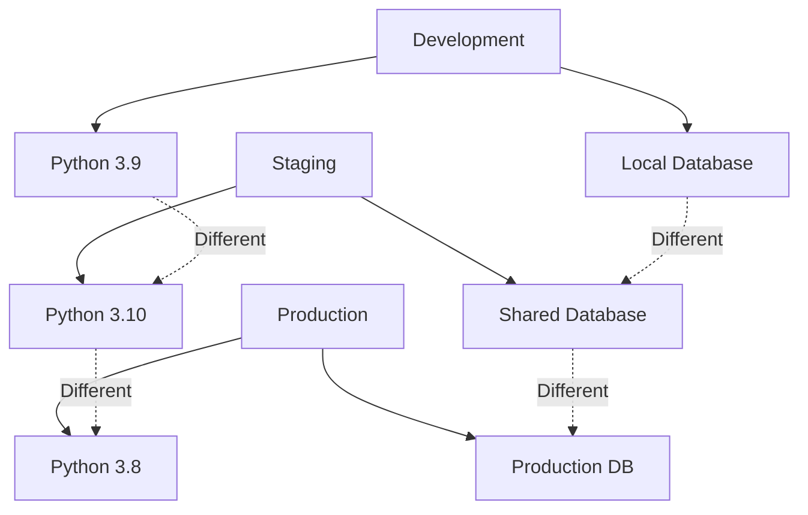
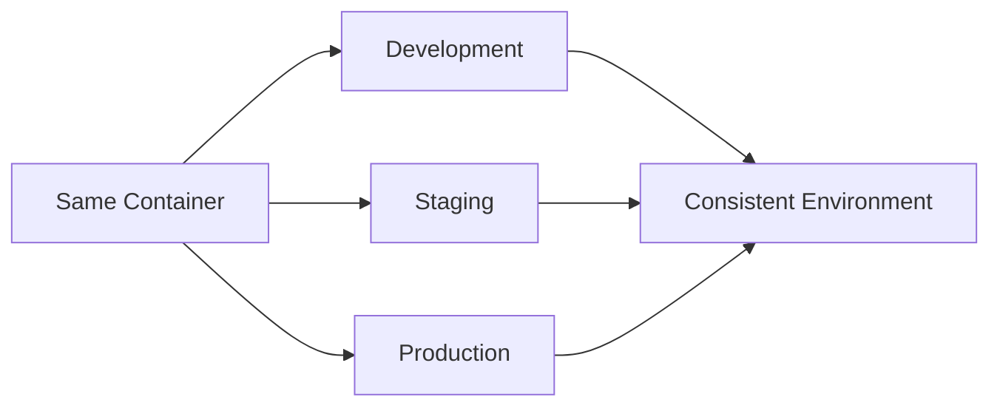
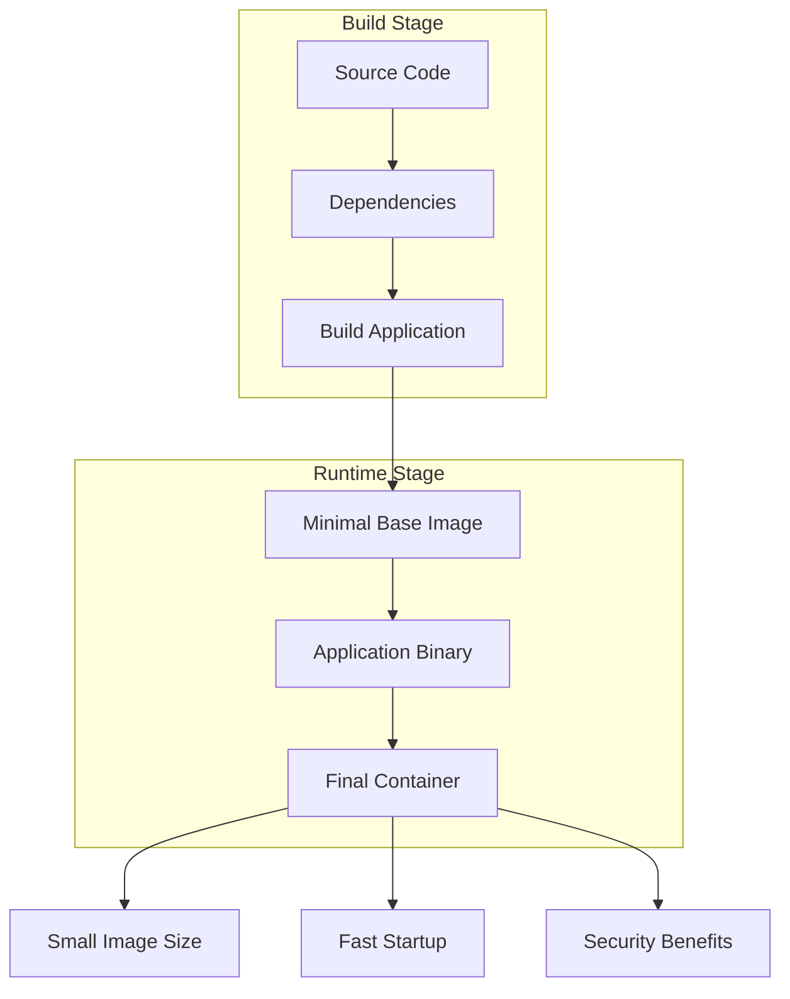
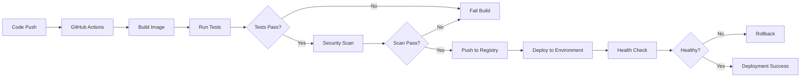
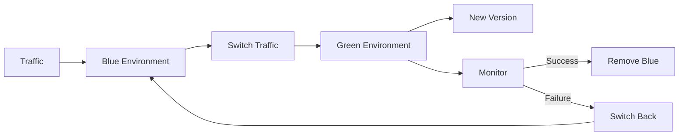
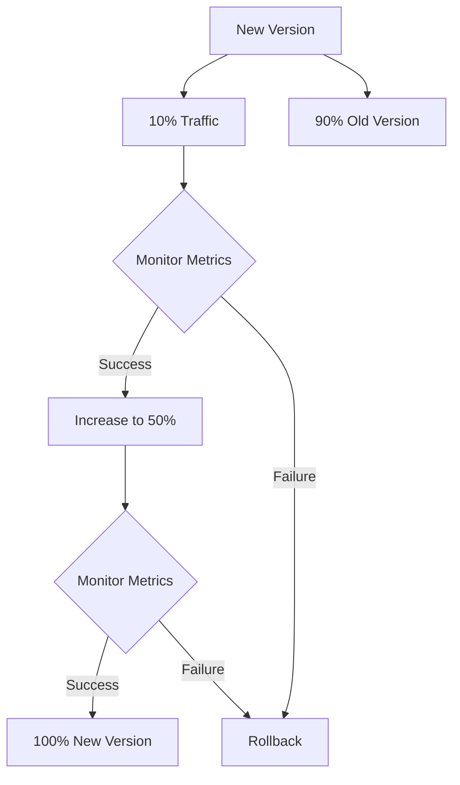

# Conduit Container

Container deployment and management solution with complete Docker and CI/CD pipeline.

import GithubLinkAdmonition from '@site/src/components/GithubLinkAdmonition';

<GithubLinkAdmonition 
    link="https://github.com/4gh0rn/conduit-container"
    title="GitHub Repository" 
    type="tip"
>
View the complete containerization setup on GitHub
</GithubLinkAdmonition>

## Conceptual Overview

This project demonstrates **containerization** and **CI/CD pipeline** concepts, showing how to build, test, and deploy applications consistently across environments using Docker and automated workflows.

### Containerization Concepts

**Containers** package applications with their dependencies, providing:
- **Isolation**: Each container runs in its own isolated environment
- **Portability**: "Build once, run anywhere" - works on any system with Docker
- **Consistency**: Same container runs identically in dev, staging, and production
- **Resource Efficiency**: Containers share the host OS kernel, using less resources than VMs

### CI/CD Pipeline Concepts

**Continuous Integration (CI)** automatically builds and tests code changes:
- **Automated Testing**: Run tests on every code change
- **Early Detection**: Catch bugs before they reach production
- **Quality Gates**: Prevent broken code from being deployed

**Continuous Deployment (CD)** automatically deploys tested code:
- **Automated Deployment**: Deploy to environments automatically
- **Consistent Process**: Same deployment process every time
- **Fast Feedback**: Quick iteration cycles

## The Problem

### Environment Inconsistency

Deploying applications across different environments faces challenges:



**Problems:**
- **Environment Differences**: Different versions, configurations
- **Dependency Hell**: "Works on my machine" syndrome
- **Configuration Drift**: Environments diverge over time
- **Manual Processes**: Error-prone human deployments
- **Slow Feedback**: Long time between code change and deployment

## The Solution

### Containerization Benefits

Containerization with Docker solves these problems:



- **Consistency**: Same container runs identically everywhere
- **Isolation**: Applications don't interfere with each other
- **Portability**: Run anywhere Docker is available
- **Automation**: CI/CD pipelines handle deployments
- **Scalability**: Easy to scale horizontally

## Key Features

### Container Orchestration
- Docker Compose for multi-container setups
- Health checks and restart policies
- Network configuration
- Volume management

### CI/CD Pipeline
- GitHub Actions for automation
- Automated testing
- Build and push to registry
- Automated deployment
- Environment-specific configurations

### Best Practices
- Multi-stage builds for optimization
- Security scanning
- Dependency management
- Configuration management
- Monitoring and logging

## Technologies Used

- **Docker**: Containerization platform
- **Docker Compose**: Multi-container orchestration
- **GitHub Actions**: CI/CD automation
- **Container Registry**: Image storage and distribution
- **DevOps**: Deployment automation

## Architecture Concepts

### Container Architecture

The project uses a **multi-stage build pattern** for optimized containers:



### CI/CD Pipeline Architecture

The CI/CD pipeline implements a **quality gate pattern**:



### Deployment Strategies

The project demonstrates different **deployment strategies**:

#### Blue-Green Deployment



**Benefits:**
- Zero-downtime deployments
- Instant rollback capability
- Easy to test new version before switching

#### Canary Deployment



**Benefits:**
- Gradual rollout reduces risk
- Real-world testing with production traffic
- Easy to abort if issues detected

## Design Patterns

### Multi-Stage Build Pattern

Reduces final image size by separating build and runtime:

```dockerfile
# Build stage
FROM node:18 AS builder
WORKDIR /app
COPY package*.json ./
RUN npm install
COPY . .
RUN npm run build

# Runtime stage
FROM node:18-alpine
WORKDIR /app
COPY --from=builder /app/dist ./dist
COPY --from=builder /app/node_modules ./node_modules
CMD ["node", "dist/index.js"]
```

**Benefits:**
- Smaller final images (only runtime dependencies)
- Faster deployments (less data to transfer)
- Better security (fewer attack surfaces)

### Health Check Pattern

Containers implement health checks for reliability:

```yaml
healthcheck:
  test: ["CMD", "curl", "-f", "http://localhost:3000/health"]
  interval: 30s
  timeout: 10s
  retries: 3
  start_period: 40s
```

**Benefits:**
- Automatic restart of unhealthy containers
- Load balancer can route away from unhealthy instances
- Monitoring systems can track container health

## Learning Outcomes

### Containerization Concepts
- **Image Layers**: Understanding Docker image layers and caching
- **Multi-Stage Builds**: Optimizing image size and build time
- **Container Isolation**: Process and filesystem isolation
- **Volume Management**: Persistent data in containers

### CI/CD Concepts
- **Pipeline as Code**: Defining pipelines in version control
- **Quality Gates**: Automated checks before deployment
- **Environment Promotion**: Moving code through dev → staging → production
- **Automated Testing**: Running tests in CI pipeline

### Deployment Concepts
- **Blue-Green Deployment**: Zero-downtime deployment strategy
- **Canary Releases**: Gradual rollout strategy
- **Rollback Strategies**: Quickly reverting failed deployments
- **Health Checks**: Monitoring container and application health

### Best Practices
- **Security Scanning**: Automated vulnerability detection
- **Dependency Management**: Keeping dependencies up to date
- **Configuration Management**: Environment-specific configs
- **Monitoring Integration**: Observability in containerized applications

## Further Reading

- [Docker Documentation](https://docs.docker.com/)
- [GitHub Actions](https://docs.github.com/en/actions)
- [Container Best Practices](https://docs.docker.com/develop/dev-best-practices/)
