# Conduit Deployment

Design and implement a workflow for automatic application rollout of the Conduit application. The workflow should be implemented following DevSecOps principles.

import GithubLinkAdmonition from '@site/src/components/GithubLinkAdmonition';

<GithubLinkAdmonition 
    link="https://github.com/4gh0rn/conduit-container"
    title="GitHub Repository" 
    type="tip"
>
View the complete CI/CD pipeline and deployment workflow on GitHub
</GithubLinkAdmonition>

## Project Goal

**Design and implement a workflow for automatic application rollout** following **DevSecOps principles**:
- **Automated Deployment**: Eliminate manual deployment steps
- **Security Integration**: Secure secret management and security checks
- **Build Automation**: Build images in CI/CD, not on production server
- **Container Registry**: Push images to container registry (GHCR)
- **SSH Deployment**: Deploy to cloud VM via SSH
- **Error Handling**: Fail-fast on errors, ensure deployment reliability

Learn to implement **CI/CD pipelines** with **DevSecOps best practices**.

## Prerequisites

### Required Knowledge
- Understanding of CI/CD concepts
- Familiarity with GitHub Actions
- Basic knowledge of Docker and container registries
- Understanding of SSH and remote deployment

### Required Software
- **GitHub Account**: For GitHub Actions and container registry
- **Docker**: For local testing (optional)
- **SSH Access**: To target deployment server

### System Requirements
- GitHub repository with Actions enabled
- Cloud VM with Docker installed
- SSH access to deployment server
- Container registry access (GitHub Container Registry)

## Conceptual Overview

### What is CI/CD?

**Continuous Integration (CI)** and **Continuous Deployment (CD)** automate the software delivery process:

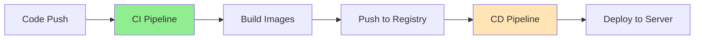

**CI Benefits:**
- **Automated Building**: Build images on every code change
- **Early Detection**: Catch build errors before deployment
- **Consistent Builds**: Same build process every time
- **Version Control**: Images tagged with commit SHA

**CD Benefits:**
- **Automated Deployment**: Deploy without manual steps
- **Fast Feedback**: Quick deployment cycles
- **Consistent Process**: Same deployment process every time
- **Rollback Capability**: Easy to revert to previous version

### DevSecOps Principles

**DevSecOps** integrates security into the DevOps workflow:

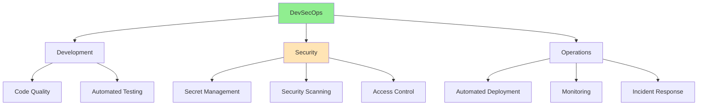

**Key Principles:**
- **Security as Code**: Security checks in CI/CD pipeline
- **Secret Management**: Secrets stored securely, not in code
- **Least Privilege**: Minimal permissions for deployment
- **Automated Security**: Security checks automated in pipeline
- **Shift Left**: Security early in development process

## The Challenge

### Manual Deployment Problems

Deploying applications manually faces challenges:

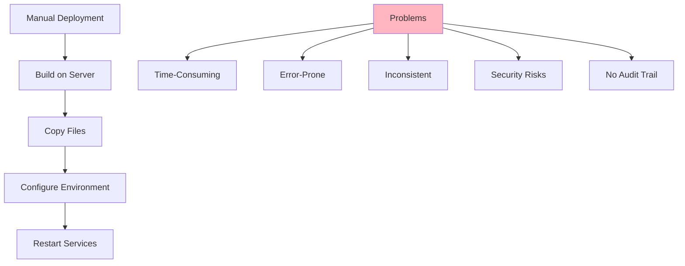

**Common Issues:**
- **Time-Consuming**: Manual steps take significant time
- **Error-Prone**: Human mistakes in deployment process
- **Inconsistent**: Different deployment each time
- **Security Risks**: Secrets in code, insecure transfers
- **No Audit Trail**: Hard to track what was deployed when
- **Build on Server**: Server resources used for building

## The Solution: Automated CI/CD Pipeline

### Pipeline Architecture

The deployment pipeline follows **DevSecOps principles**:

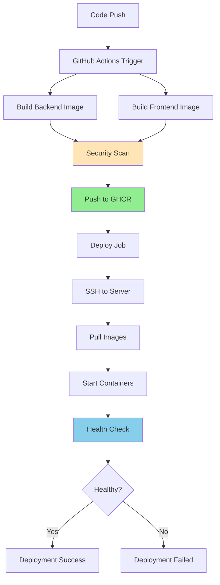

**Pipeline Stages:**
1. **Build**: Create container images in CI environment
2. **Security**: Scan images for vulnerabilities
3. **Push**: Upload images to container registry
4. **Deploy**: Pull and deploy on production server
5. **Verify**: Health checks ensure deployment success

### Build in CI, Not on Server

**Build images in GitHub Actions**, not on production server:

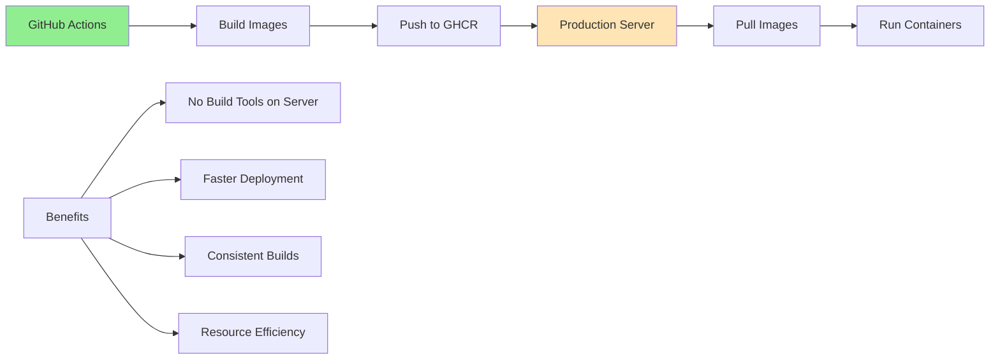

**Benefits:**
- **Server Efficiency**: Production server doesn't need build tools
- **Faster Deployment**: Only pull pre-built images
- **Consistent Builds**: Same build environment every time
- **Resource Optimization**: Build resources separate from production

### Secret Management

**DevSecOps secret management** in GitHub Actions:

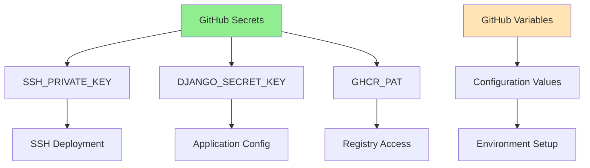

**Security Benefits:**
- **No Secrets in Code**: All secrets in GitHub Secrets
- **Access Control**: Only authorized workflows can access secrets
- **Audit Trail**: GitHub tracks secret usage
- **Rotation Support**: Easy to rotate secrets without code changes

### Deployment Process

**Automated deployment via SSH**:

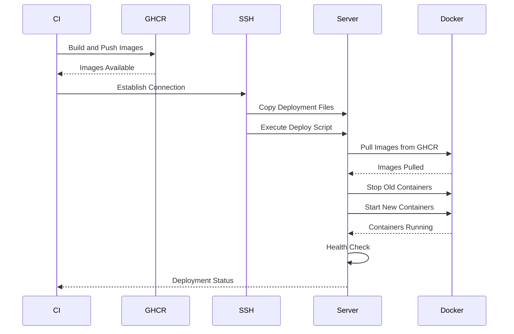

**Deployment Steps:**
1. **Build Images**: Create images in GitHub Actions
2. **Push to Registry**: Upload to GitHub Container Registry
3. **SSH Connection**: Connect to production server
4. **Copy Files**: Transfer compose file and deploy script
5. **Pull Images**: Download images from registry
6. **Deploy**: Start containers in detached mode
7. **Verify**: Health check confirms deployment success

## Architecture Concepts

### CI/CD Pipeline Pattern

The workflow implements a **two-stage pipeline**:

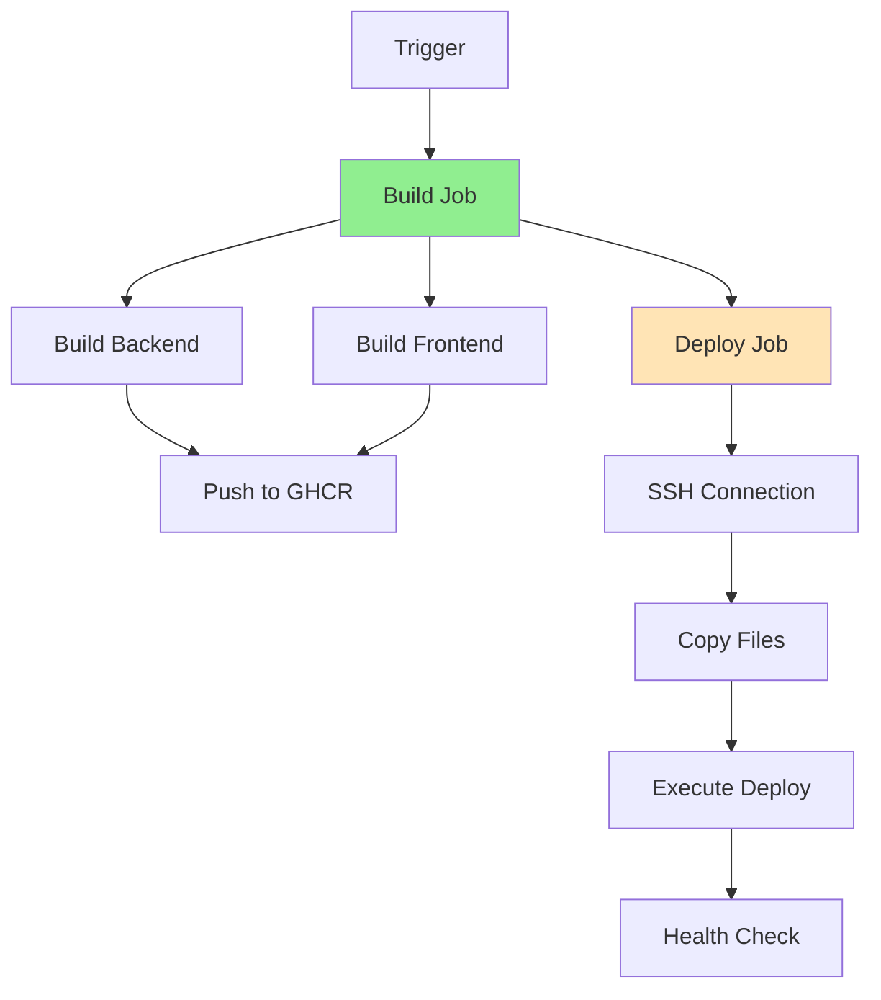

**Job Separation:**
- **Build Job**: Independent, can run on any runner
- **Deploy Job**: Depends on build, requires SSH access
- **Parallel Builds**: Backend and frontend build in parallel
- **Sequential Deployment**: Deploy after successful build

### Container Registry Pattern

**GitHub Container Registry (GHCR)** for image storage:

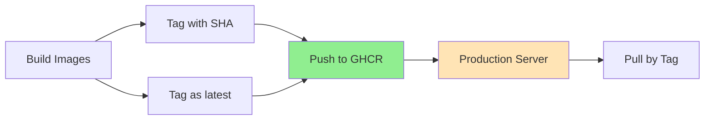

**Registry Benefits:**
- **Version Control**: Images tagged with commit SHA
- **Latest Tag**: Easy access to most recent build
- **Access Control**: Private/public image management
- **Integration**: Native GitHub integration

### SSH Deployment Pattern

**Secure deployment via SSH**:

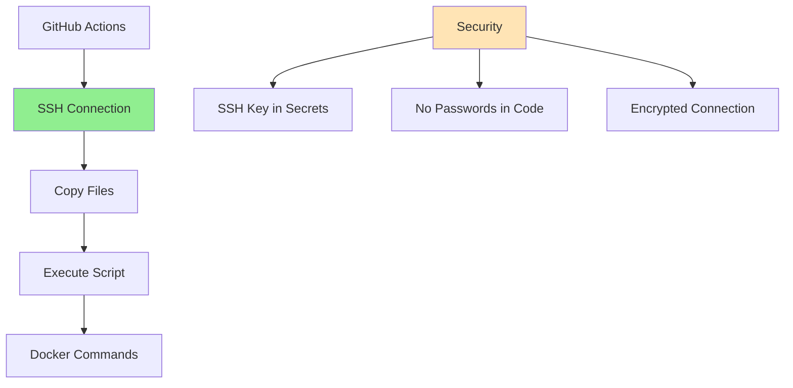

**SSH Benefits:**
- **Secure Connection**: Encrypted communication
- **Key-Based Auth**: SSH keys, no passwords
- **Remote Execution**: Execute commands on remote server
- **File Transfer**: Secure file copying

### DevSecOps Security Integration

**Security integrated into pipeline**:

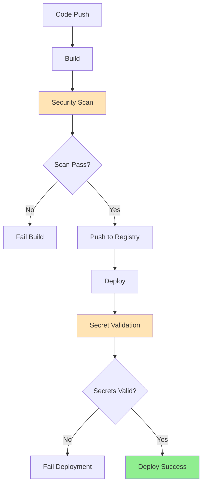

**Security Measures:**
- **Secret Validation**: Fail-fast if required secrets missing
- **Environment Variables**: All config via secure variables
- **Access Control**: GitHub Environments for deployment protection
- **Audit Trail**: GitHub tracks all deployment actions

## Learning Outcomes

### CI/CD Concepts
- **Pipeline as Code**: Defining workflows in YAML
- **Job Dependencies**: Managing job execution order
- **Artifact Management**: Sharing files between jobs
- **Environment Management**: Using GitHub Environments

### DevSecOps Principles
- **Secret Management**: Secure handling of sensitive data
- **Security Scanning**: Automated vulnerability detection
- **Access Control**: Least privilege, environment protection
- **Security as Code**: Security checks in pipeline

### Deployment Automation
- **SSH Deployment**: Remote server deployment via SSH
- **Container Registry**: Image storage and distribution
- **Health Checks**: Automated deployment verification
- **Error Handling**: Fail-fast on deployment errors

### Best Practices
- **Build in CI**: Don't build on production server
- **Image Tagging**: Version control for container images
- **Secret Rotation**: Easy secret updates without code changes
- **Deployment Verification**: Health checks ensure success

## Best Practices

### Security
- **Never commit secrets**: Use GitHub Secrets for all sensitive data
- **Environment Protection**: Use GitHub Environments for production
- **SSH Key Management**: Store SSH keys in GitHub Secrets
- **Secret Validation**: Fail-fast if required secrets missing

### CI/CD Pipeline
- **Job Separation**: Separate build and deploy jobs
- **Parallel Builds**: Build multiple images in parallel
- **Artifact Management**: Share files between jobs efficiently
- **Error Handling**: Fail-fast on any error

### Deployment
- **Detached Mode**: Run containers in detached mode
- **Health Checks**: Verify deployment with health endpoints
- **Rollback Strategy**: Keep previous images for rollback
- **Logging**: Centralize deployment logs

### Configuration Management
- **Environment Variables**: All config via GitHub Variables
- **Default Values**: Provide safe defaults
- **Validation**: Validate configuration before deployment
- **Documentation**: Document all required secrets and variables

## Troubleshooting

### Build Failures
- Check build logs in GitHub Actions
- Verify Dockerfile syntax
- Check build context includes all files
- Verify build arguments are set correctly

### Deployment Failures
- Verify SSH connection: Check SSH key in secrets
- Check server access: Ensure server is reachable
- Verify secrets: All required secrets must be set
- Check deployment logs: Review SSH action output

### Image Pull Issues
- Verify GHCR access: Check GHCR_PAT secret
- Check image tags: Verify correct tag used
- Verify registry permissions: Ensure read access to images
- Check network: Server must access GHCR

### Health Check Failures
- Check container logs: `docker compose logs`
- Verify ports: Ensure ports are accessible
- Check environment variables: Verify all config set
- Review application logs: Check for startup errors

## Further References

- [GitHub Actions Documentation](https://docs.github.com/en/actions)
- [GitHub Container Registry](https://docs.github.com/en/packages/working-with-a-github-packages-registry/working-with-the-container-registry)
- [DevSecOps Principles](https://www.devsecops.org/)
- [SSH Deployment Best Practices](https://docs.github.com/en/actions/deployment/security-hardening-your-deployments)
