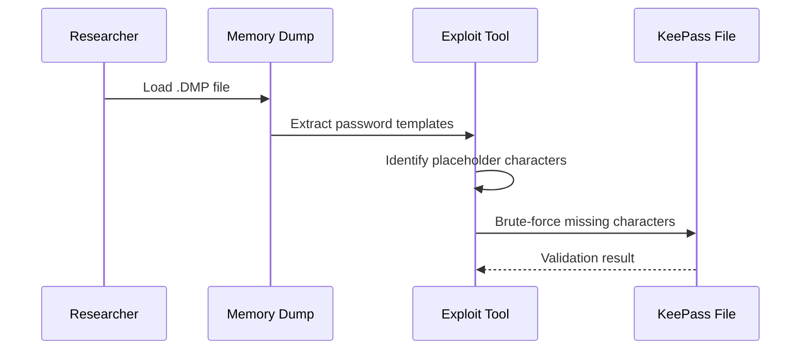

# Security Exploits Research

Security research and proof-of-concept development for CVE vulnerabilities. Learn to understand, analyze, and responsibly exploit security vulnerabilities for educational purposes and authorized penetration testing.

## Project Goal

**Research and develop proof-of-concept exploits** for security vulnerabilities:
- **Vulnerability Analysis**: Understanding how security vulnerabilities work
- **Exploit Development**: Creating proof-of-concept exploits
- **Security Research**: Analyzing CVE vulnerabilities in depth
- **Responsible Disclosure**: Ethical security research practices

Learn to **analyze security vulnerabilities** and develop **responsible exploit tools** for authorized security testing.

## Prerequisites

### Required Knowledge
- Understanding of security vulnerabilities and CVEs
- Python programming skills
- Basic knowledge of memory analysis
- Understanding of encryption and password management

### Required Software
- **Python 3.7+**: For exploit development
- **Virtual Environment**: For dependency management
- **Security Tools**: Various tools depending on the CVE being researched

## CVE-2023-32784: KeePass Master Password Leakage

**Severity**: High  
**Affected Versions**: KeePass 2.x before version 2.54  
**Status**: Fully functional exploit developed  
**Success Rate**: 100% (3/3 test files cracked)

### Vulnerability Overview

CVE-2023-32784 is a critical vulnerability in KeePass password manager that allows recovery of plaintext master passwords from memory dumps. The vulnerability exists because KeePass 2.x before version 2.54 stores the master password in plaintext in memory, even when the workspace is locked or the application is no longer active.

**Impact:**
- **Password Recovery**: Master passwords can be recovered from memory dumps
- **Security Breach**: Complete compromise of password database
- **Data Exposure**: All stored passwords become accessible

### How the Exploit Works

The exploit follows a structured approach:



**Exploitation Steps:**
1. **File Discovery**: Scan directory for .DMP/.kdbx file pairs
2. **Password Extraction**: Extract password templates from memory dumps using pattern `0xCF 0x25`
3. **Template Analysis**: Identify placeholder characters (●) in extracted templates
4. **Intelligent Brute-Force**: Systematically replace placeholders with possible characters
5. **Validation**: Test passwords against KeePass database files
6. **Output**: Save results in .potfile format with SHA256 hashes

### Technical Details

**Password Extraction:**
- Searches for characteristic pattern `0xCF 0x25` in memory dumps
- Extracts UTF-16-LE encoded password candidates
- Identifies missing characters represented by placeholders
- Generates all possible password combinations

**Hash Generation:**
- Each .kdbx file gets unique SHA256 hash based on complete file content
- Hash serves as fingerprint to correlate cracked passwords with databases
- Content-based identification works even with corrupted headers

**Brute-Force Strategy:**
- Character set: ASCII letters, numbers, special characters
- Optimized character set for many placeholders
- Systematic testing of all combinations
- Early termination on successful password validation

### Exploit Features

**Automation:**
- Automatic detection of .DMP/.kdbx file pairs
- Batch processing of multiple databases
- Intelligent brute-force with optimized character sets
- Clean output format (.potfile)

**Output Format:**
```
SHA256_HASH:PASSWORD
5247db0df09ebe91fdca95734b63a2fbce7c7ce36a5279a4aa7b46ae4851a5a7:HJCu897QLIKGE6E.
a058d3f738f5845be9ccc6cc9096d85809a64ad588927784bbc85187ea2fe9af:K7pGi.HbGJMjz!0f31
```

## Learning Outcomes

### Security Research Skills
- **CVE Analysis**: Understanding vulnerability details and impact
- **Exploit Development**: Creating proof-of-concept tools
- **Memory Analysis**: Extracting information from memory dumps
- **Pattern Recognition**: Identifying security-relevant patterns

### Technical Skills
- **Python Development**: Building security tools
- **Brute-Force Techniques**: Implementing intelligent password cracking
- **Hash Generation**: Creating unique identifiers for files
- **File Processing**: Handling binary and text file formats

## Best Practices

### Security Research Ethics
- **Authorization Only**: Only test systems you own or have explicit permission
- **Controlled Environment**: Use isolated test environments
- **Responsible Disclosure**: Report vulnerabilities through proper channels
- **Educational Purpose**: Use knowledge to improve security

### Exploit Development
- **Comprehensive Testing**: Test thoroughly with various scenarios
- **Error Handling**: Robust error handling and logging
- **Documentation**: Clear documentation of functionality
- **Code Quality**: Clean, maintainable code

## Security Disclaimer

### Educational Purpose Only

**This research and all its contents are created exclusively for educational purposes** as part of security research and training. All security testing was performed in controlled, legal environments with proper authorization.

### Ethical Guidelines
- ✅ All activities performed on authorized test systems only
- ✅ No unauthorized access to systems or data
- ✅ Knowledge intended to improve security, not compromise it
- ✅ Responsible disclosure practices followed

### Legal Notice

**Unauthorized access to computer systems is illegal.** The techniques and tools demonstrated here should only be used:
- In authorized penetration testing engagements
- On systems you own or have explicit written permission to test
- In designated security training environments
- For legitimate security research with proper authorization

**Never use these techniques on production systems or systems you don't own without explicit written authorization.**

## Further References

- [CVE Details](https://cve.mitre.org/)
- [OWASP Testing Guide](https://owasp.org/www-project-web-security-testing-guide/)
