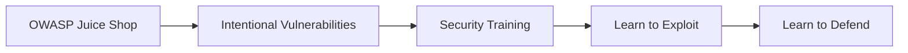
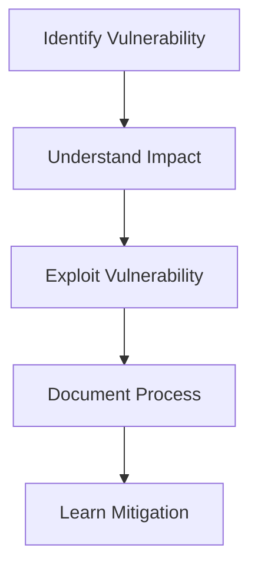
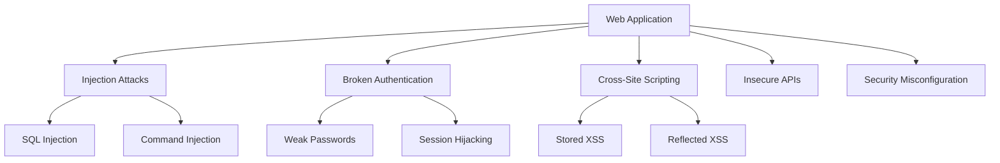
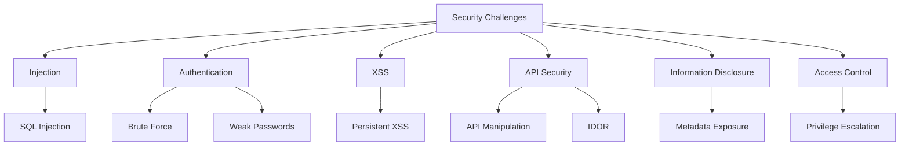

# Juice Shop Meister

Security-focused learning project using OWASP Juice Shop to understand web application vulnerabilities, penetration testing techniques, and security best practices.

import GithubLinkAdmonition from '@site/src/components/GithubLinkAdmonition';

<GithubLinkAdmonition 
    link="https://github.com/4gh0rn/juice-shop-challange"
    title="GitHub Repository" 
    type="tip"
>
View the complete challenge documentation and security analysis on GitHub
</GithubLinkAdmonition>

## Project Goal

**Learn web application security** through hands-on practice with OWASP Juice Shop - an intentionally vulnerable web application designed for security training. The project focuses on:
- **Understanding Vulnerabilities**: Learning common web application security flaws
- **Penetration Testing**: Practical experience with ethical hacking techniques
- **Security Awareness**: Recognizing and mitigating security risks
- **Documentation**: Creating clear, reproducible security documentation

## Prerequisites

### Required Knowledge
- Basic understanding of web applications
- Familiarity with HTTP requests and responses
- Basic knowledge of web technologies (HTML, JavaScript, APIs)
- Understanding of security concepts (helpful but not required)

### Required Software
- **OWASP Juice Shop**: Intentionally vulnerable application
- **Burp Suite**: Web security testing tool
- **Browser DevTools**: Built-in browser developer tools
- **Python 3**: For automation scripts
- **ExifTool**: For metadata extraction (optional)

### System Requirements
- Operating system with Docker support (for running Juice Shop)
- Minimum 2GB RAM
- Internet connection

## Conceptual Overview

### What is OWASP Juice Shop?

OWASP Juice Shop is an **intentionally insecure web application** designed for security training:

**Purpose:**
- **Educational Tool**: Learn security vulnerabilities in safe environment
- **Real-World Scenarios**: Based on actual OWASP Top 10 vulnerabilities
- **Hands-On Practice**: Practical exploitation experience
- **Security Awareness**: Understand impact of insecure code

### Security Learning Approach

The project follows a **structured security learning methodology**:

**Learning Cycle:**
1. **Identify**: Recognize security vulnerabilities
2. **Understand**: Learn how vulnerabilities work
3. **Exploit**: Practice exploitation techniques
4. **Document**: Create reproducible documentation
5. **Mitigate**: Learn defensive strategies

## The Challenge

### Web Application Security Problems

Modern web applications face numerous security challenges:

**Common Issues:**
- **Injection Vulnerabilities**: SQL, NoSQL, Command injection
- **Broken Authentication**: Weak passwords, session management flaws
- **Sensitive Data Exposure**: Unencrypted data, weak encryption
- **XML External Entities**: XXE attacks
- **Broken Access Control**: Unauthorized access to resources
- **Security Misconfiguration**: Default credentials, exposed debug info
- **Cross-Site Scripting**: XSS attacks
- **Insecure Deserialization**: Remote code execution
- **Using Components with Known Vulnerabilities**: Outdated libraries
- **Insufficient Logging & Monitoring**: Missing security events

## The Solution: Security Training

### OWASP Top 10 Coverage

The project covers vulnerabilities from the **OWASP Top 10 2021**:

**A01:2021 – Broken Access Control**
- Privilege escalation
- Unauthorized access to resources
- IDOR (Insecure Direct Object Reference)

**A02:2021 – Cryptographic Failures**
- Weak password hashing
- Insecure data transmission

**A03:2021 – Injection**
- SQL Injection
- NoSQL Injection
- Command Injection

**A04:2021 – Insecure Design**
- Security flaws in application design
- Missing security controls

**A05:2021 – Security Misconfiguration**
- Default credentials
- Exposed debug information
- Insecure configurations

**A06:2021 – Vulnerable and Outdated Components**
- Using outdated libraries
- Known vulnerabilities in dependencies

**A07:2021 – Identification and Authentication Failures**
- Weak authentication mechanisms
- Session management flaws
- Password policy issues

**A08:2021 – Software and Data Integrity Failures**
- Insecure deserialization
- CI/CD pipeline vulnerabilities

**A09:2021 – Security Logging and Monitoring Failures**
- Insufficient logging
- Missing security event monitoring

**A10:2021 – Server-Side Request Forgery (SSRF)**
- Server-side request manipulation
- Internal network access

### Challenge Categories

The project includes challenges across multiple security categories:

> [!NOTE]
> **Complete Challenge List**: This project includes documentation for **9 security challenges** covering various OWASP Top 10 categories. For a complete list of all challenges with detailed documentation, see the [Challenges Overview](https://github.com/4gh0rn/juice-shop-challange#challenges-overview) in the repository.

## Key Learning Outcomes

### Technical Skills
- **Vulnerability Recognition**: Identifying security flaws in web applications
- **Exploitation Techniques**: Practical hands-on exploitation experience
- **Security Testing**: Using tools like Burp Suite, SQLMap, ExifTool
- **Traffic Analysis**: Understanding HTTP requests and responses
- **Automation**: Creating scripts for brute-force and automated testing

### Security Awareness
- **Impact Assessment**: Understanding business and technical impact of vulnerabilities
- **Defensive Strategies**: Learning how to prevent and mitigate vulnerabilities
- **Secure Coding**: Recognizing insecure coding practices
- **Risk Management**: Assessing and prioritizing security risks

### Professional Skills
- **Security Documentation**: Creating clear, reproducible security reports
- **Video Presentations**: Demonstrating technical security concepts
- **Ethical Hacking**: Understanding responsible disclosure and ethical guidelines
- **Security Reporting**: Communicating security findings effectively

## Security Concepts

### SQL Injection

**What it is:**
SQL Injection occurs when user input is improperly sanitized and directly included in SQL statements, allowing attackers to modify query logic.

**Impact:**
- Unauthorized data access
- Authentication bypass
- Data manipulation or deletion
- Complete database compromise

**Example Challenge:**
Login as Jim - Exploiting SQL injection in login form to bypass authentication.

### Cross-Site Scripting (XSS)

**What it is:**
XSS vulnerabilities allow attackers to inject malicious scripts into web pages viewed by other users.

**Types:**
- **Stored XSS**: Malicious script stored in database
- **Reflected XSS**: Malicious script reflected in response
- **DOM-based XSS**: Client-side script manipulation

**Impact:**
- Session hijacking
- Cookie theft
- Defacement
- Malware distribution

**Example Challenge:**
API-only XSS - Exploiting persistent XSS through API endpoints.

### Broken Authentication

**What it is:**
Authentication mechanisms that are incorrectly implemented, allowing attackers to compromise passwords, keys, or session tokens.

**Common Issues:**
- Weak password policies
- Insecure session management
- Credential stuffing
- Brute-force vulnerabilities

**Impact:**
- Unauthorized account access
- Identity theft
- Privilege escalation
- Data breach

**Example Challenges:**
- Password Strength - Brute-force attack on weak passwords
- Empty User Registration - Bypassing input validation

### Insecure Direct Object References (IDOR)

**What it is:**
When an application provides direct access to objects based on user-supplied input without proper authorization checks.

**Impact:**
- Unauthorized data access
- Information disclosure
- Data manipulation
- Privacy violations

**Example Challenge:**
Restore Progress Backup - Manipulating API endpoints to access unauthorized data.

### Information Disclosure

**What it is:**
Accidental exposure of sensitive information through error messages, metadata, or misconfiguration.

**Common Sources:**
- Error messages
- File metadata (EXIF data)
- Debug information
- Configuration files

**Impact:**
- System information leakage
- User privacy violations
- Attack surface expansion
- Credential exposure

**Example Challenge:**
Meta Geo Stalking - Extracting location data from image metadata.

## Tools and Techniques

### Security Testing Tools

**Burp Suite:**
- HTTP proxy for intercepting and modifying requests
- Vulnerability scanning
- Manual testing support
- Repeater for request manipulation

**Browser DevTools:**
- Network traffic inspection
- JavaScript debugging
- DOM manipulation
- Storage inspection

**Python Scripts:**
- Automated brute-force attacks
- API testing automation
- Request manipulation
- Data extraction

**ExifTool:**
- Image metadata extraction
- EXIF data analysis
- Location information extraction

### Testing Methodology

**Reconnaissance:**
- Application mapping
- Route discovery
- API endpoint enumeration
- Technology stack identification

**Vulnerability Identification:**
- Manual testing
- Automated scanning
- Code review (when available)
- Traffic analysis

**Exploitation:**
- Proof of concept development
- Payload crafting
- Attack automation
- Impact verification

**Documentation:**
- Step-by-step reproduction
- Mitigation strategies
- Impact assessment

## Best Practices

### Security Testing Ethics
- **Authorized Testing Only**: Only test systems you own or have explicit permission
- **Controlled Environment**: Use intentionally vulnerable applications for training
- **Responsible Disclosure**: Report vulnerabilities through proper channels
- **Educational Purpose**: Use knowledge to improve security, not compromise it

### Documentation Standards
- **Reproducible Steps**: Clear, step-by-step instructions
- **Impact Assessment**: Document business and technical impact
- **Mitigation Strategies**: Provide defensive recommendations

### Learning Approach
- **Understand Before Exploiting**: Learn how vulnerabilities work
- **Think Like an Attacker**: Understand attack vectors
- **Think Like a Defender**: Learn prevention strategies
- **Continuous Learning**: Security landscape evolves constantly

## Security Disclaimer

### Educational Purpose Only

**This project and all its contents are created exclusively for educational purposes** as part of a DevSecOps training program. All security testing was performed in a controlled environment using OWASP Juice Shop - an intentionally vulnerable application designed for security training.

### Ethical Guidelines
- ✅ All activities performed on authorized test systems only
- ✅ No real user data accessed or compromised
- ✅ No actual systems harmed
- ✅ Knowledge intended to improve security, not compromise it

### Legal Notice

**Unauthorized access to computer systems is illegal.** The techniques demonstrated here should only be used:
- In authorized penetration testing engagements
- On systems you own or have explicit written permission to test
- In designated security training environments
- For legitimate security research with proper authorization

**Never use these techniques on production systems or systems you don't own without explicit written authorization.**

## Further References

- [OWASP Top 10 2021](https://owasp.org/www-project-top-ten/)
- [OWASP Juice Shop Project](https://owasp.org/www-project-juice-shop/)
- [OWASP Testing Guide](https://owasp.org/www-project-web-security-testing-guide/)
- [Web Security Academy by PortSwigger](https://portswigger.net/web-security)
- [OWASP Cheat Sheet Series](https://cheatsheetseries.owasp.org/)
