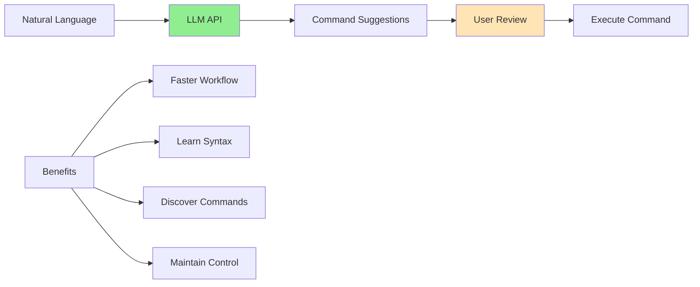
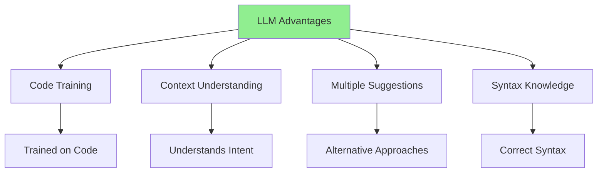
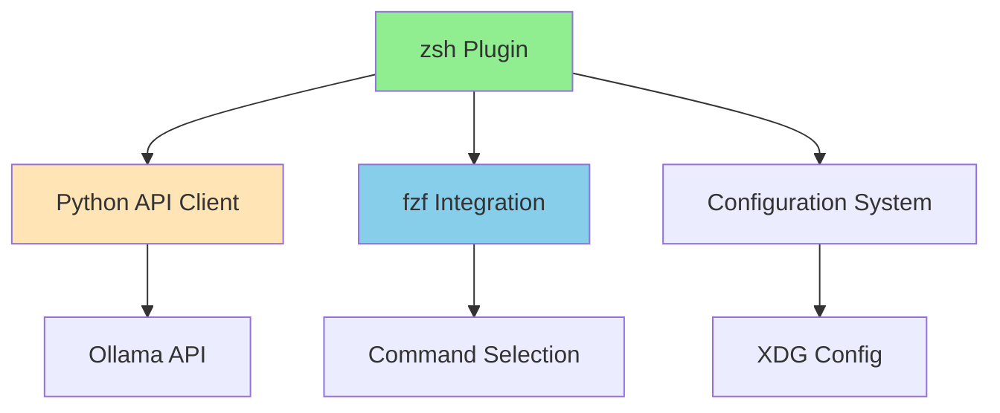
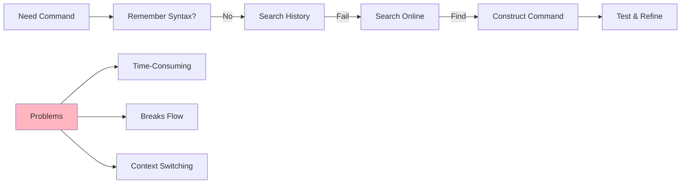
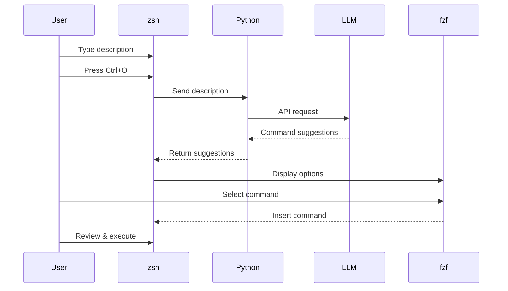
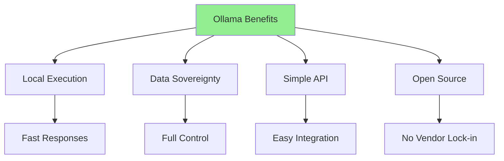
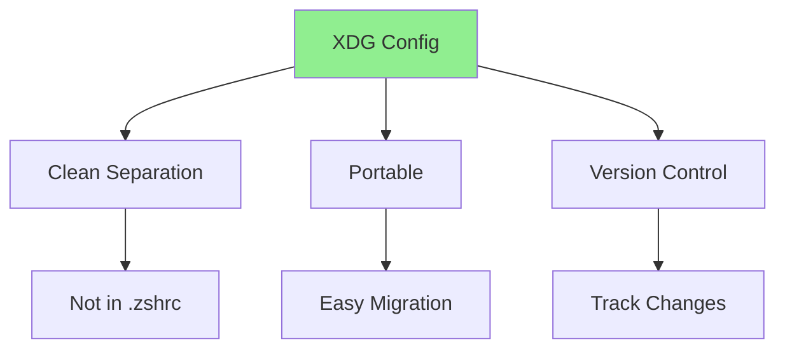
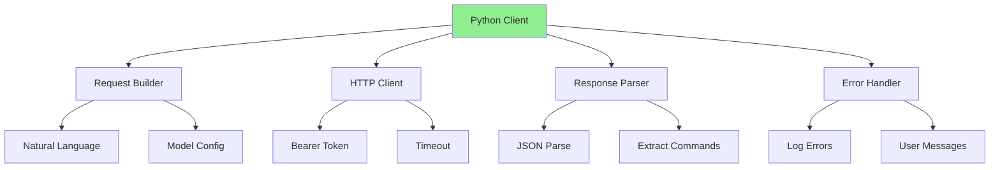
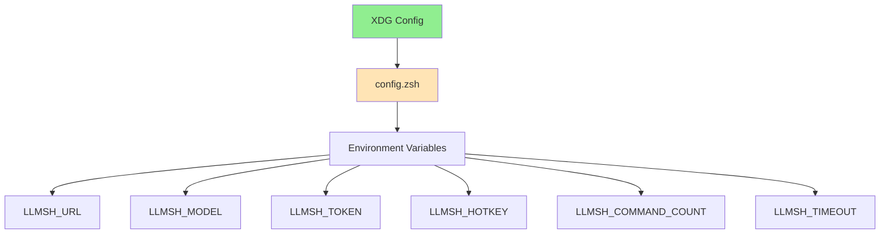

# llmsh

Build a zsh plugin that transforms natural language descriptions into ready-to-run shell commands using LLMs. Learn to integrate AI capabilities into terminal workflows, design clean plugin architectures, and create tools that enhance productivity without replacing user control.

import GithubLinkAdmonition from '@site/src/components/GithubLinkAdmonition';

<GithubLinkAdmonition 
    link="https://github.com/brsksh/llmsh"
    title="GitHub Repository" 
    type="tip"
>
View the complete source code and documentation on GitHub
</GithubLinkAdmonition>

## Project Goal

**Build a zsh plugin that uses LLMs to transform natural language into shell commands**:
- **Natural Language Interface**: Describe what you want to do in plain English
- **LLM Integration**: Use Ollama-compatible APIs for command generation
- **Terminal Workflow**: Work entirely within the terminal, no context switching
- **User Control**: Review suggestions before execution, maintain full control
- **Seamless Integration**: Integrate with existing tools (zsh, fzf, Oh-My-Zsh)

Learn to **integrate AI capabilities into terminal workflows** while maintaining user control and understanding.

## Prerequisites

### Required Knowledge
- Understanding of shell scripting (bash/zsh)
- Basic Python programming
- Familiarity with terminal workflows
- Understanding of API design and HTTP requests

### Required Software
- **zsh**: Z shell (version 5.0 or higher)
- **Oh-My-Zsh**: zsh configuration framework
- **Python 3**: Python 3.8 or higher
- **fzf**: Fuzzy finder for command selection
- **jq**: JSON processor
- **curl**: HTTP client
- **Ollama**: Local or remote Ollama-compatible API endpoint

### System Requirements
- Unix-like operating system (Linux, macOS)
- Terminal with zsh support
- Internet connection (for remote Ollama instances) or local Ollama installation

## Conceptual Overview

### What is LLM-Powered Command Generation?

LLM-powered command generation uses **Large Language Models** to understand natural language descriptions and generate syntactically correct shell commands:

**Key Concepts:**
- **Natural Language Understanding**: LLMs understand context and intent
- **Code Generation**: LLMs excel at generating syntactically correct code
- **User Review**: Always review suggestions before execution
- **Workflow Integration**: Seamless integration with existing terminal tools

### Why LLMs for Command Generation?

Large Language Models are well-suited for command generation:

**Why It Works:**
- **Vast Training Data**: LLMs trained on millions of code examples
- **Context Awareness**: Understands file operations, system administration, etc.
- **Multiple Alternatives**: Can suggest different approaches to the same task
- **Syntax Knowledge**: Knows correct syntax for various commands and flags

### Plugin Architecture

The plugin follows a **modular architecture** with clear separation of concerns:

**Architecture Components:**
- **zsh Plugin**: Shell integration and keybinding
- **Python Client**: Handles LLM API communication
- **fzf Integration**: Fuzzy selection of command suggestions
- **Configuration**: XDG-based config system

## The Challenge

### Terminal Workflow Friction

Working in the terminal often involves friction when constructing commands:

**Common Issues:**
- **Time-Consuming**: Searching for command syntax takes time
- **Breaks Flow**: Interrupts workflow to look up commands
- **Context Switching**: Need to leave terminal to search online
- **Syntax Errors**: Easy to make mistakes when constructing commands manually

## The Solution: LLM-Powered Command Generation

### Workflow Integration

The plugin integrates seamlessly into terminal workflow:

**Workflow Benefits:**
- **No Context Switching**: Everything happens in terminal
- **Fast**: Get suggestions in seconds
- **Review Before Execute**: Always review before running
- **Natural**: Describe what you want, not how to do it

### Design Decisions

**Ollama Compatibility** - Why Ollama-compatible APIs?

**Key Benefits:**
- **Local Execution**: Run models locally for privacy and speed
- **Data Sovereignty**: Full control over data, no external services
- **Simple API**: Easy to integrate, well-documented
- **Open Source**: No vendor lock-in, customizable

**fzf Integration** - Why fuzzy finder?

**Benefits:**
- **Fuzzy Search**: Quickly find the right command
- **Keyboard Navigation**: No mouse needed
- **Visual Feedback**: Clear interface for selection
- **Familiar**: Terminal users already know fzf

**XDG Config** - Why XDG directory standard?

**Benefits:**
- **Clean Separation**: Config separate from shell files
- **Portable**: Easy to share and migrate
- **Version Control**: Can track config changes
- **Standard**: Follows XDG directory standards

## Architecture Concepts

### API Client Design

The Python API client handles LLM communication:

**Client Features:**
- **Bearer Token Support**: Secure authentication for remote instances
- **Configurable Timeouts**: Handle slow API responses
- **Error Handling**: Comprehensive error messages
- **Multiple Suggestions**: Request multiple command alternatives

### Shell Integration

The zsh plugin provides seamless shell integration:

**Integration Features:**
- **Keybinding**: Customizable hotkey (default Ctrl+O)
- **Buffer Capture**: Captures current command line
- **Non-Blocking**: Doesn't block shell during API call
- **Command Insertion**: Inserts selected command into prompt

### Configuration System

Configuration uses XDG directory standard:

**Configuration Options:**
- **LLMSH_URL**: Ollama endpoint URL
- **LLMSH_MODEL**: Model name (e.g., llama3)
- **LLMSH_TOKEN**: Optional bearer token
- **LLMSH_HOTKEY**: Keybinding (e.g., ^o)
- **LLMSH_COMMAND_COUNT**: Number of suggestions
- **LLMSH_TIMEOUT**: API timeout in seconds

## Learning Outcomes

### LLM Integration
- **API Design**: Design clean APIs for LLM communication
- **Error Handling**: Handle API errors gracefully
- **Authentication**: Implement bearer token authentication
- **Response Processing**: Parse and extract useful information from LLM responses

### Terminal Tool Development
- **Plugin Architecture**: Build modular, maintainable plugins
- **Shell Integration**: Integrate tools seamlessly into shell workflows
- **User Experience**: Design intuitive terminal interfaces
- **Tool Composition**: Combine existing tools (fzf, zsh) effectively

### Python Development
- **CLI Tools**: Build command-line tools in Python
- **HTTP Clients**: Make API requests with proper error handling
- **Configuration Management**: Handle configuration files and environment variables
- **Logging**: Implement comprehensive logging for debugging

### Best Practices
- **User Control**: Always allow user review before execution
- **Configuration**: Use standard configuration locations (XDG)
- **Documentation**: Provide clear installation and usage instructions
- **Error Messages**: Provide helpful, actionable error messages

## Best Practices

### Security
- **Review Commands**: Always review generated commands before execution
- **Token Security**: Store tokens securely, not in shell history
- **Local Models**: Use local models for sensitive operations
- **Input Validation**: Validate user input before sending to API

### User Experience
- **Visual Feedback**: Show spinner during API calls
- **Error Messages**: Provide clear, actionable error messages
- **Configuration**: Make configuration easy and intuitive
- **Documentation**: Provide comprehensive documentation

### Code Quality
- **Modular Design**: Separate concerns (API client, shell integration, config)
- **Error Handling**: Comprehensive error handling throughout
- **Logging**: Detailed logging for debugging
- **Testing**: Test API client independently

### Integration
- **Tool Composition**: Leverage existing tools (fzf, zsh)
- **Standards**: Follow XDG directory standards
- **Compatibility**: Support Ollama-compatible APIs for flexibility
- **Portability**: Make configuration portable across systems

## Troubleshooting

### API Connection Issues
- Verify Ollama endpoint URL is correct
- Check network connectivity
- Verify bearer token if using authenticated instance
- Check API timeout settings

### Command Quality Issues
- Try different LLM models
- Provide more context in description
- Request multiple suggestions and compare
- Review commands carefully before execution

### Performance Issues
- Use local Ollama instance for faster responses
- Reduce number of suggestions requested
- Increase timeout for slow connections
- Consider caching common queries

### Integration Issues
- Verify Oh-My-Zsh is installed
- Check plugin is enabled in `.zshrc`
- Verify fzf is installed and in PATH
- Check Python dependencies are installed

## Further References

- [llmsh Blog Post](https://brsk.sh/blog/building-llmsh-terminal-assistant/)
- [Ollama Documentation](https://ollama.ai/docs)
- [Oh-My-Zsh Plugin Development](https://github.com/ohmyzsh/ohmyzsh/wiki/Plugins)
- [fzf Documentation](https://github.com/junegunn/fzf)
- [XDG Base Directory Specification](https://specifications.freedesktop.org/basedir-spec/basedir-spec-latest.html)
