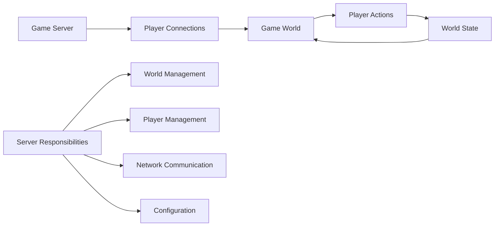
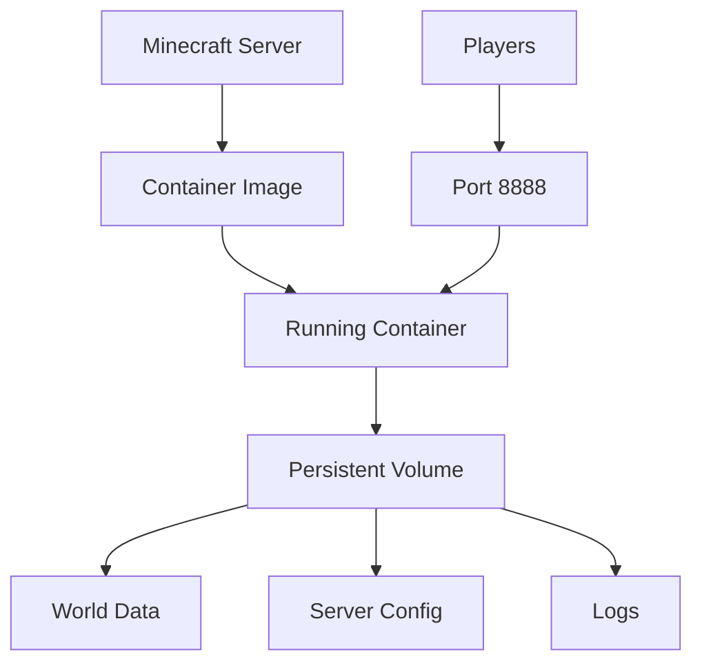
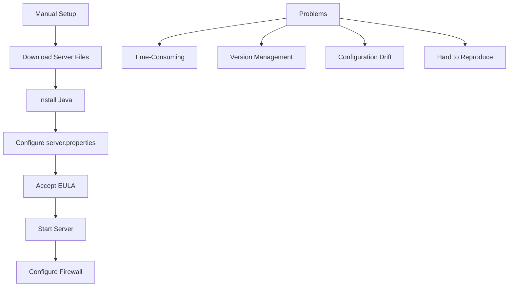
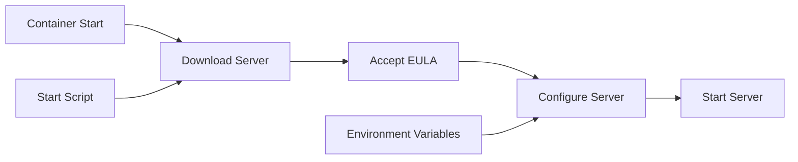
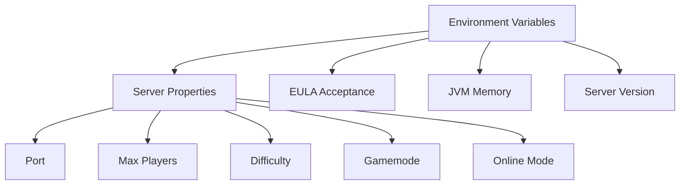
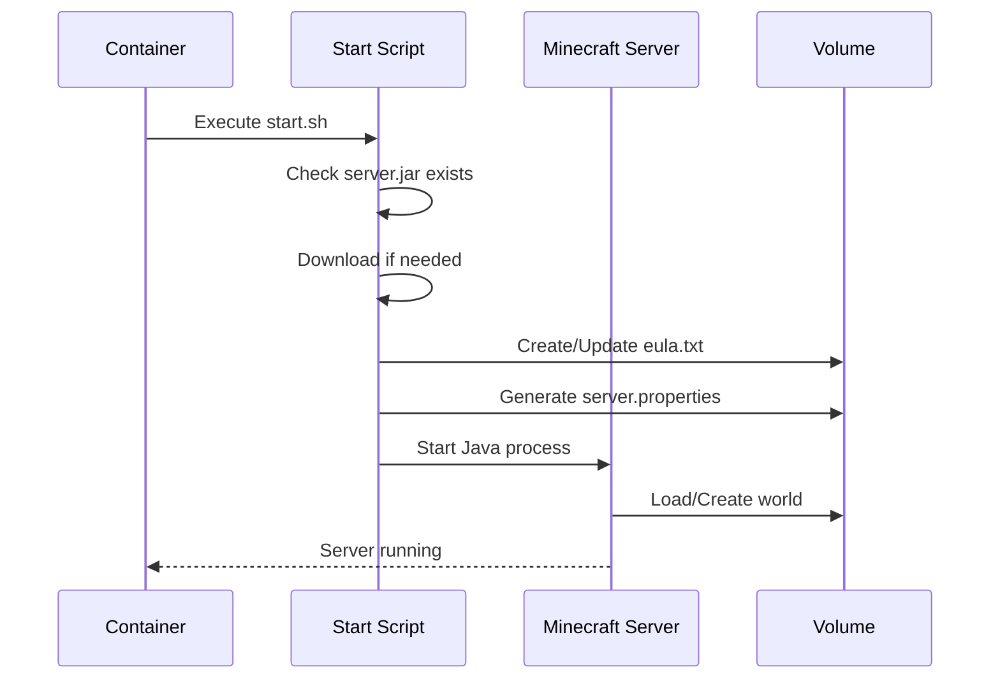
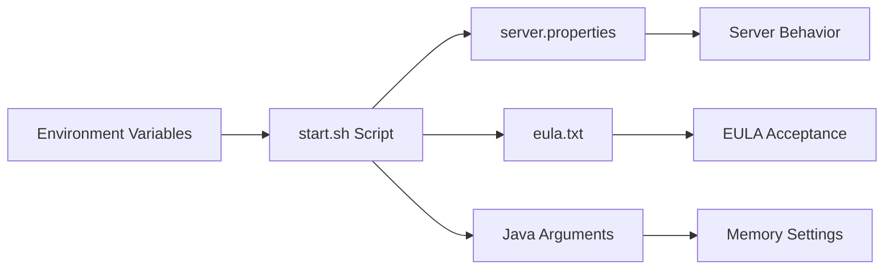
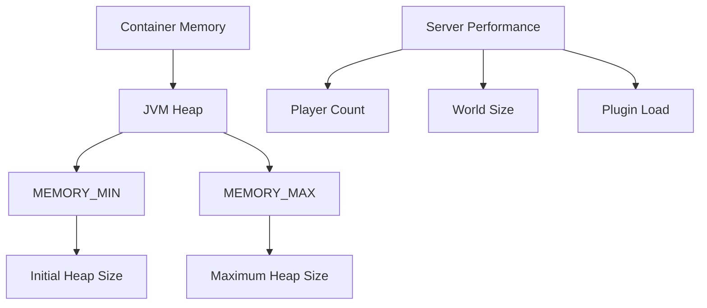

# Minecraft Server

Learn how to host and operate your own game server. Understand the associated tasks and responsibilities using the popular game classic "Minecraft" as an example. Configure your server and world exactly as you like. Mods can be added manually to the volume, but are not automatically managed by this setup.

import GithubLinkAdmonition from '@site/src/components/GithubLinkAdmonition';

<GithubLinkAdmonition 
    link="https://github.com/4gh0rn/mc-server"
    title="GitHub Repository" 
    type="tip"
>
View the complete Minecraft server setup and Docker configuration on GitHub
</GithubLinkAdmonition>

## Project Goal

**Host and operate your own game server** and learn the associated tasks and responsibilities using Minecraft as an example:
- **Server Hosting**: Understand what it takes to run a game server
- **Configuration Management**: Configure server and world settings
- **Containerization**: Package server in container for easy deployment
- **Operations**: Learn server management, monitoring, and maintenance
- **Automated Deployment**: Optional GitHub Actions workflow for self-hosted runner deployment

Configure your server and world exactly as you like. Mods can be added manually to the volume, but are not automatically managed by this setup.

## Prerequisites

### Required Knowledge
- Basic understanding of servers and networking
- Familiarity with command line
- Basic knowledge of Docker (helpful but not required)

### Required Software
- **Docker**: Containerization platform
- **Docker Compose**: Container orchestration tool
- **Minecraft Java Edition**: For connecting to server (optional, for testing)
- **Java 21**: Server runs on Java 21 (eclipse-temurin:21-jdk) - included in container

### System Requirements
- Operating system with Docker support
- Minimum 2GB RAM (4GB+ recommended for better performance)
- Port 8888 available (or configure different port)
- Internet connection for downloading server files

## Conceptual Overview

### What is Game Server Hosting?

Game server hosting involves **running a server application** that manages game sessions:



**Server Responsibilities:**
- **World Management**: Maintain game world state, chunks, entities
- **Player Management**: Handle player connections, authentication, permissions
- **Network Communication**: Manage client-server communication
- **Configuration**: Server settings, game rules, world properties

### Containerized Game Server

Containerization provides **consistent server deployment**:



**Benefits:**
- **Easy Deployment**: One command to start server
- **Consistent Environment**: Same server setup everywhere
- **Data Persistence**: World data survives container restarts
- **Configuration Management**: Environment variables for all settings

## The Challenge

### Traditional Game Server Setup

Setting up a game server traditionally involves:



**Common Issues:**
- **Time-Consuming**: Manual setup takes 30-60 minutes
- **Version Management**: Downloading and managing server versions
- **Configuration Complexity**: Multiple configuration files
- **Data Loss Risk**: World data not properly backed up
- **Reproducibility**: Hard to replicate exact server setup

## The Solution: Containerization

### Automated Server Setup

Containerization automates **server deployment and configuration**:



**Benefits:**
- **Automated Setup**: Server configured automatically on start
- **Version Management**: Easy to switch Minecraft versions
- **Configuration**: All settings via environment variables
- **Reproducible**: Same server setup every time

### Persistent World Data

**Named volumes** ensure world data persists:

```mermaid
graph TB
    A[Container Restart] --> B{Volume Present?}
    B -->|Yes| C[World Data Preserved]
    B -->|No| D[New World Created]
    
    E[minecraft-data Volume] --> E1[World Files]
    E --> E2[server.properties]
    E --> E3[Logs]
    E --> E4[Plugins/Mods (manual)]
```

**Volume Benefits:**
- **Data Persistence**: World survives container restarts
- **Backup Support**: Easy to backup volume data
- **Migration**: Move world to different server easily
- **Isolation**: World data separated from container

### Server Configuration

All server settings managed through **environment variables**:



**Configuration Benefits:**
- **Centralized**: All settings in one place (`.env` file)
- **Flexible**: Easy to change without editing files
- **Git-Safe**: Configuration not in code repository
- **Reproducible**: Same configuration every time

## Architecture Concepts

### Server Startup Process

The server follows an **automated startup sequence**:



**Startup Steps:**
1. **Version Check**: Verify correct server version downloaded
2. **EULA Acceptance**: Automatically accept EULA if configured
3. **Configuration**: Generate `server.properties` from environment variables
4. **Server Start**: Launch Java process with configured memory settings

### Configuration Management

**Dynamic Configuration** via environment variables:



**Configuration Flow:**
- Environment variables set in `.env` or `compose.yml`
- Start script reads variables and generates configuration files
- Server reads configuration on startup
- Changes require container restart to take effect

### Resource Management

**JVM Memory Configuration** for optimal performance:



**Memory Considerations:**
- **MEMORY_MIN**: Initial heap size (e.g., 1G)
- **MEMORY_MAX**: Maximum heap size (e.g., 2G)
- **Player Count**: More players need more memory
- **World Size**: Larger worlds require more memory
- **Plugins/Mods**: Additional memory needed if manually added mods/plugins

## Learning Outcomes

### Game Server Operations
- **Server Hosting**: Understanding what it takes to run a game server
- **Configuration Management**: Managing server settings and world properties
- **Version Management**: Handling different Minecraft server versions
- **Resource Management**: JVM memory configuration and optimization

### Containerization Concepts
- **Containerized Applications**: Packaging server applications in containers
- **Volume Management**: Persistent data storage for game worlds
- **Environment Configuration**: Managing configuration via environment variables
- **Automated Startup**: Scripts for automated server initialization

### Server Responsibilities
- **World Management**: Understanding how game worlds are managed
- **Player Management**: Handling player connections and authentication
- **Network Communication**: Server-client communication protocols
- **Data Persistence**: Ensuring world data survives restarts

### Best Practices
- **Backup Strategies**: Regular backups of world data
- **Security Configuration**: Online mode, firewall rules
- **Performance Tuning**: Memory settings, server optimization
- **Monitoring**: Log management and server health checks

## Best Practices

### Server Configuration
- **Memory Settings**: Configure based on expected player count
- **Online Mode**: Enable for production (requires Mojang authentication)
- **Backup Strategy**: Regular backups of world data volume
- **Version Management**: Keep server version updated
- **Deployment**: Optional GitHub Actions workflow available for self-hosted runner deployment

### Security
- **Online Mode**: Enable `ONLINE_MODE=true` for authentication
- **Firewall Rules**: Only expose necessary ports
- **Access Control**: Use whitelist for player access control
- **Regular Updates**: Keep server version and base image updated

### Data Management
- **Volume Backups**: Regular backup of `minecraft-data` volume
- **World Backups**: Additional backups of world directory
- **Log Management**: Monitor and rotate server logs
- **Migration Planning**: Document volume migration process

### Performance
- **Memory Allocation**: Allocate sufficient memory for player count
- **Resource Limits**: Set container memory limits
- **Monitoring**: Monitor server performance and resource usage
- **Optimization**: Tune server.properties for performance

## Troubleshooting

### Server Won't Start
- Check logs: `docker compose logs mc-server`
- Verify EULA is accepted: `EULA=true` in environment
- Check Java version compatibility (server uses Java 21)
- Ensure sufficient memory allocated

### Connection Issues
- Verify port 8888 is accessible
- Check firewall rules
- Verify `ONLINE_MODE` setting matches authentication needs
- Check server logs for connection errors
- Use `mcstatus` tool to check server status: `mcstatus <host>:<port> status`

### Performance Issues
- Increase `MEMORY_MAX` if server is slow
- Check container resource limits
- Monitor server logs for errors
- Consider reducing `MAX_PLAYERS` if needed

### Data Not Persisting
- Verify volume is created: `docker volume ls`
- Check volume mounts in `compose.yml`
- Ensure volume not removed with `-v` flag
- Verify volume permissions

## Further References

- [Minecraft Server Download](https://www.minecraft.net/de-de/download)
- [Docker Documentation](https://docs.docker.com/)
- [Docker Compose Documentation](https://docs.docker.com/compose/)
- [Minecraft Server Properties](https://minecraft.fandom.com/wiki/Server.properties)
- [mcstatus Tool](https://github.com/py-mine/mcstatus) - Check server status programmatically
