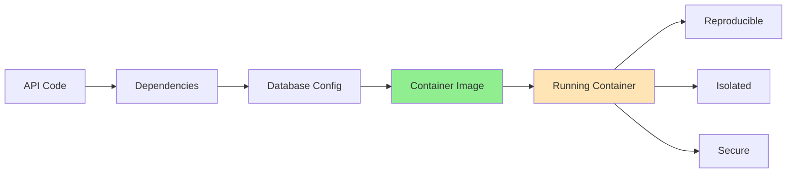
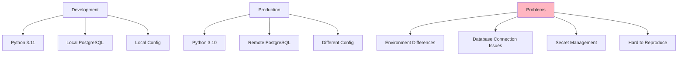
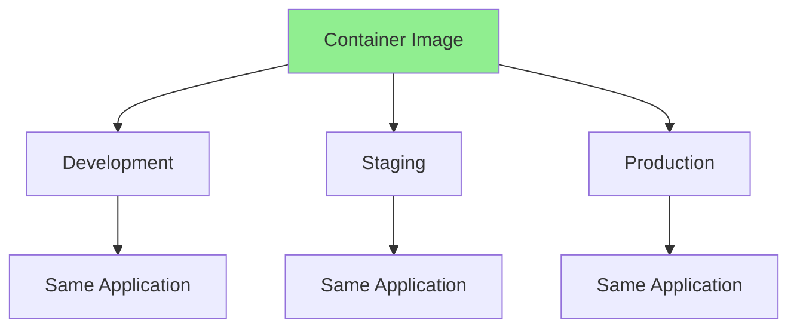
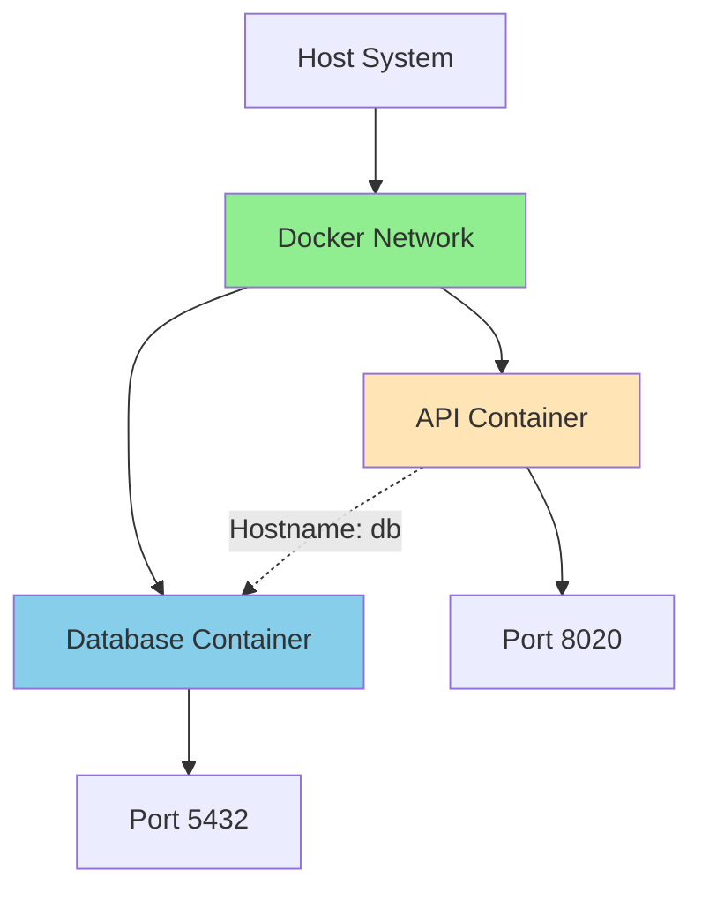
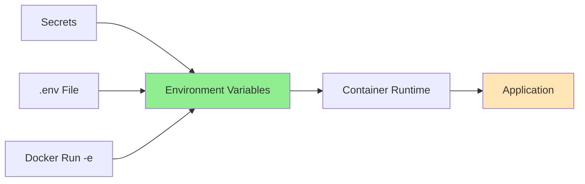

# Truck Signs API

Containerize a REST API and ensure the application can be operated reproducibly, isolated, and securely. Learn to apply container fundamentals and configure them properly.

import GithubLinkAdmonition from '@site/src/components/GithubLinkAdmonition';

<GithubLinkAdmonition 
    link="https://github.com/4gh0rn/truck_signs_api"
    title="GitHub Repository" 
    type="tip"
>
View the complete source code and Docker configuration on GitHub
</GithubLinkAdmonition>

## Project Goal

**Containerize a REST API** and ensure the application can be operated:
- **Reproducibly**: Same application runs identically every time
- **Isolated**: Application runs in isolated environment, separate from host system
- **Securely**: Sensitive data managed through environment variables, no hardcoded secrets

Learn to apply **container fundamentals** and configure containers for production use.

## Prerequisites

### Required Knowledge
- Basic understanding of REST APIs
- Familiarity with command line
- Basic Python/Django knowledge (helpful but not required)

### Required Software
- **Docker**: Containerization platform (version 20.0 or higher)
- **Git**: Version control

### System Requirements
- Operating system with Docker support
- Minimum 2GB RAM
- Internet connection for downloading images

## Conceptual Overview

### What is Containerization for APIs?

Containerization packages a REST API with all dependencies into a **container** - ensuring reproducible, isolated, and secure operation:



### Core Concepts

**Reproducibility** - Same application every time:
- **Consistent Environment**: Same Python version, packages, configuration
- **Version Control**: Container configuration tracked in Git
- **Predictable Behavior**: Application behaves identically across environments

**Isolation** - Application runs separately:
- **Process Isolation**: API container isolated from database container
- **Network Isolation**: Containers communicate through Docker networks
- **Filesystem Isolation**: Each container has its own file system
- **Resource Isolation**: CPU and memory limits per container

**Security** - Secure operation:
- **No Hardcoded Secrets**: All sensitive data in environment variables
- **Network Security**: Containers communicate only through defined networks
- **Access Control**: Limited container permissions
- **Secret Management**: Environment variables for passwords, keys, tokens

## The Challenge

### Traditional API Deployment Problems

Without containers, deploying REST APIs faces challenges:



**Common Issues:**
- Different Python versions between environments
- Database connection configuration differences
- Hardcoded secrets in code
- Difficult to reproduce exact environment
- Database and API on different systems

## The Solution: Containerization

### Reproducibility

Containers ensure **reproducible deployments**:



**Benefits:**
- **Same Image Everywhere**: Build once, run anywhere
- **Consistent Behavior**: Application behaves identically
- **Version Control**: Track container versions
- **Easy Rollback**: Revert to previous image version

### Isolation with Docker Networks

Containers communicate through **Docker networks**:



**Network Benefits:**
- **Isolated Communication**: Containers communicate only within network
- **Hostname Resolution**: Containers find each other by name
- **Security**: Network isolation prevents external access
- **Flexibility**: Easy to add/remove containers

**Example:**
```bash
# Create network
docker network create truck-signs-network

# Run database
docker run -d --name db --network truck-signs-network postgres:15

# Run API (connects to 'db' hostname)
docker run -d --name api --network truck-signs-network \
  -e DOCKER_DB_HOST=db truck-signs-api
```

### Security with Environment Variables

All sensitive data managed through **environment variables**:



**Security Benefits:**
- **No Hardcoded Secrets**: Passwords, keys in environment variables
- **Git-Safe**: `.env` file excluded from version control
- **Flexible Configuration**: Different values per environment
- **Access Control**: Only authorized users see secrets

## Container Configuration

### Environment Variables

**Required Variables:**
- `DOCKER_SECRET_KEY`: Django secret key
- `DOCKER_DB_NAME`: Database name
- `DOCKER_DB_USER`: Database username
- `DOCKER_DB_PASSWORD`: Database password
- `DOCKER_DB_HOST`: Database hostname (container name in network)
- `SUPERUSER_PASSWORD`: Admin user password

**Optional Variables:**
- `DOCKER_DB_PORT`: Database port (default: 5432)
- `SUPERUSER_USERNAME`: Admin username (default: admin)
- `SUPERUSER_EMAIL`: Admin email
- `DOCKER_STRIPE_PUBLISHABLE_KEY`: Stripe public key
- `DOCKER_STRIPE_SECRET_KEY`: Stripe secret key
- `DOCKER_EMAIL_HOST_USER`: SMTP username
- `DOCKER_EMAIL_HOST_PASSWORD`: SMTP password
- `ALLOWED_HOSTS`: Production hosts
- `FRONTEND_URL`: Frontend URL

### Docker Network Setup

**Why Networks?**
- Containers in same network can communicate
- Containers find each other by hostname
- Network isolation provides security

**Network Creation:**
```bash
# Create network
docker network create truck-signs-network

# List networks
docker network ls

# Inspect network
docker network inspect truck-signs-network
```

**Container Communication:**
- API container connects to database using hostname (container name)
- No need for IP addresses
- Automatic DNS resolution within network
- Containers in same network can communicate by name

### Entrypoint Automation

The entrypoint script automates startup:

```bash
# Runs automatically when container starts
1. Database migrations (python manage.py migrate)
2. Static files collection (python manage.py collectstatic)
3. Superuser creation (if needed)
4. WSGI server start (gunicorn)
```

**Benefits:**
- **Automated Setup**: No manual steps required
- **Consistent Startup**: Same process every time
- **Production Ready**: Uses Gunicorn, not development server

## Learning Outcomes

### Container Fundamentals
- **Image Building**: Creating container images with Dockerfile
- **Container Networking**: Setting up Docker networks for communication
- **Environment Configuration**: Managing secrets with environment variables
- **Entrypoint Scripts**: Automating container startup

### Reproducibility
- **Consistent Deployments**: Same application everywhere
- **Version Control**: Tracking container configurations
- **Image Management**: Building and tagging images
- **Rollback Capability**: Reverting to previous versions

### Isolation
- **Process Isolation**: Containers run separately
- **Network Isolation**: Containers communicate through networks
- **Filesystem Isolation**: Each container has own file system
- **Resource Isolation**: Limiting CPU/memory per container

### Security
- **Secret Management**: Environment variables for sensitive data
- **Network Security**: Isolated container communication
- **Access Control**: Limited container permissions
- **Best Practices**: No hardcoded secrets, secure defaults

## Best Practices

### Security
- **Never commit `.env` files**: Use `.env.example` as template
- **Use strong secrets**: Generate secure passwords and keys
- **Limit network access**: Only expose necessary ports
- **Regular updates**: Keep base images updated

### Configuration
- **Environment variables**: All configuration via env vars
- **Default values**: Provide sensible defaults where safe
- **Documentation**: Document all required variables
- **Validation**: Validate configuration on startup

### Container Management
- **Restart policies**: Use `--restart unless-stopped`
- **Resource limits**: Set CPU/memory limits
- **Health checks**: Monitor container health
- **Logging**: Centralize container logs

### Database
- **Volume persistence**: Use volumes for database data
- **Backup strategy**: Regular database backups
- **Connection pooling**: Configure for production
- **Migration management**: Track schema changes

## Troubleshooting

### Container Won't Start
- Check logs: `docker logs truck-signs-api`
- Verify environment variables
- Check network connectivity
- Ensure database container is running

### Database Connection Issues
- Verify containers are in same network
- Check database hostname (use container name)
- Verify database credentials
- Check database container logs

### Port Already in Use
```bash
# Find process using port
lsof -i :8020

# Use different port
docker run -p 8021:8020 ...
```

### Permission Issues
- Check file permissions in container
- Verify volume mount permissions
- Check Docker daemon permissions

## Further References

- [Docker Documentation](https://docs.docker.com/)
- [Docker Networking](https://docs.docker.com/network/)
- [Django REST Framework](https://www.django-rest-framework.org/)
- [PostgreSQL Docker Image](https://hub.docker.com/_/postgres)
