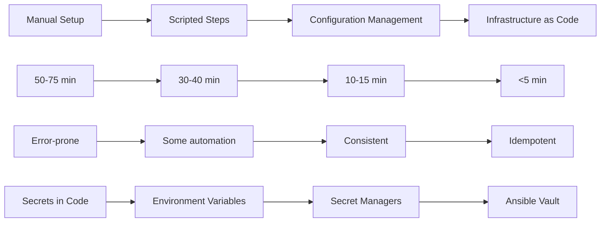
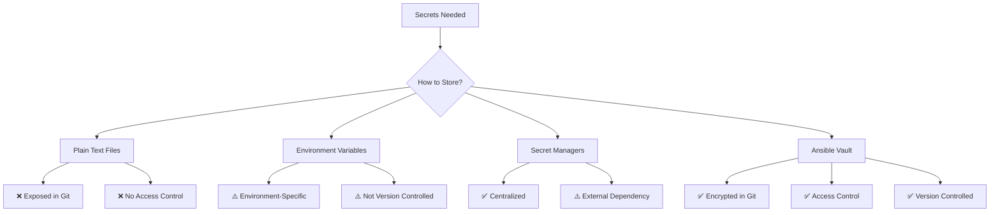
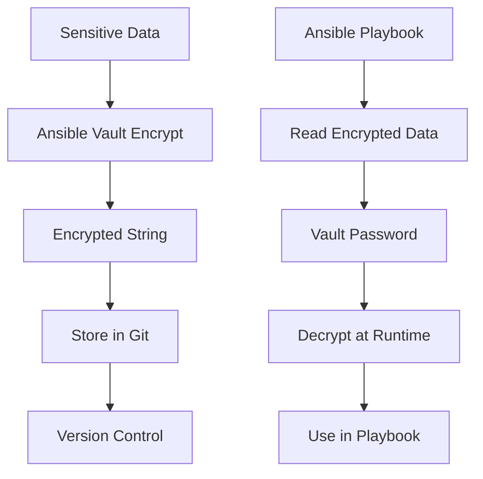
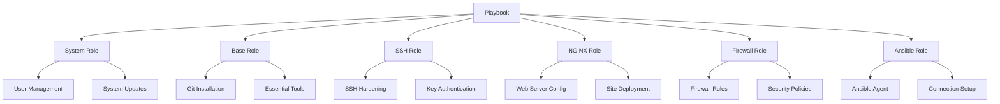
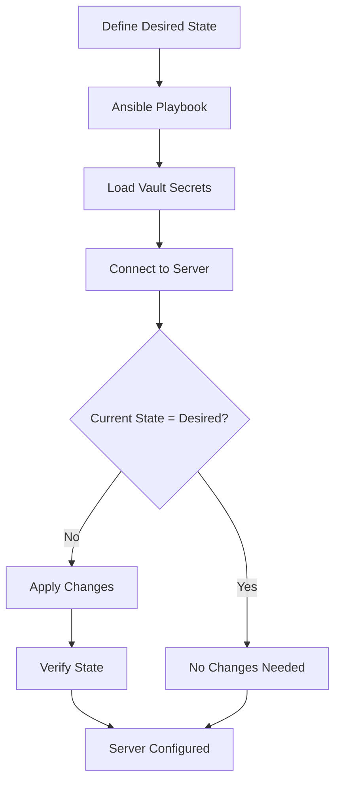
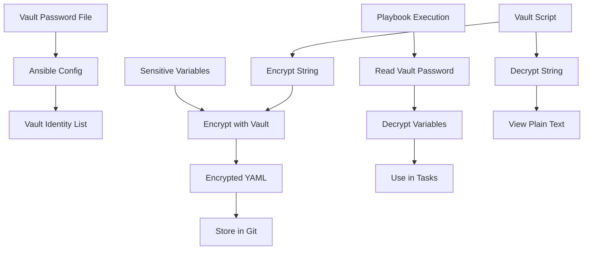
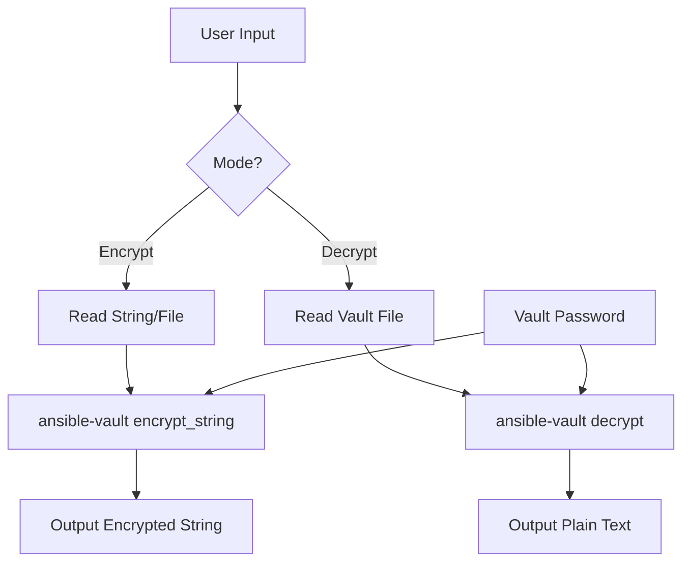
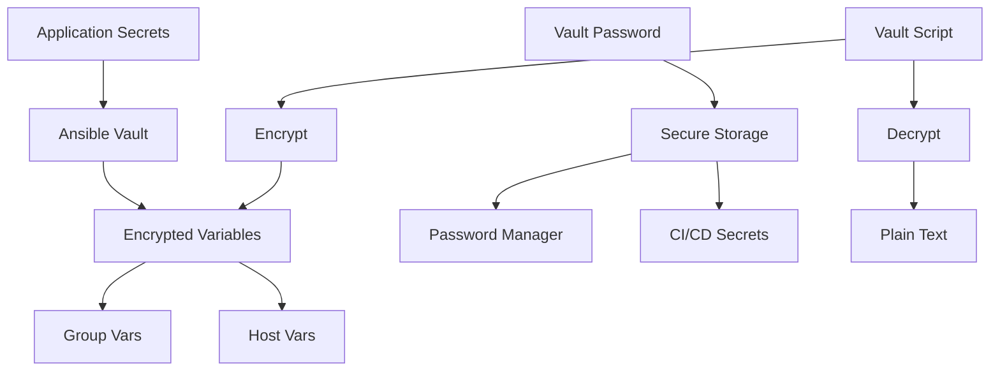

# V-Server Setup

Complete Ubuntu server configuration - from manual steps to Infrastructure as Code with Ansible, including secure secret management with Ansible Vault.

import GithubLinkAdmonition from '@site/src/components/GithubLinkAdmonition';

<GithubLinkAdmonition 
    link="https://github.com/4gh0rn/v-server-setup"
    title="GitHub Repository" 
    type="tip"
>
View the complete source code and Ansible playbooks on GitHub
</GithubLinkAdmonition>

## Conceptual Overview

This project demonstrates the **evolution from manual to automated infrastructure management** - a journey that many DevOps teams undertake. It showcases how Infrastructure as Code (IaC) transforms server configuration from a manual, error-prone process into a repeatable, automated workflow, while securely managing sensitive data through Ansible Vault.

### The Evolution Journey

The project follows a typical infrastructure automation evolution:



### Core Concepts

**Infrastructure as Code (IaC)** treats infrastructure configuration as software code:
- **Version Controlled**: All changes tracked in Git
- **Idempotent**: Running the same playbook multiple times produces the same result
- **Declarative**: Define desired state, not steps to achieve it
- **Testable**: Can validate configurations before applying

**Configuration Management** ensures servers maintain their intended state:
- **Desired State**: Define what the server should look like
- **Drift Detection**: Identify when servers deviate from desired state
- **Automated Remediation**: Automatically fix configuration drift

**Secret Management** protects sensitive data in version control:
- **Encryption at Rest**: Secrets encrypted in Git repositories
- **Access Control**: Only authorized users can decrypt secrets
- **Audit Trail**: Track who accessed and modified secrets
- **Rotation Support**: Easy to rotate passwords and keys

## The Challenge

### Manual Server Setup Problems

Setting up a new server manually involves:
- **Time-Consuming**: 50-75 minutes per server
- **Error-Prone**: Human mistakes in configuration
- **Inconsistent**: Each server ends up slightly different
- **Not Scalable**: Can't efficiently manage multiple servers
- **No Audit Trail**: Hard to track what was changed and why

### Secret Management Challenges

Managing sensitive data in infrastructure automation presents unique challenges:



**Common Problems:**
- **Secrets in Plain Text**: Passwords, SSH keys, and API tokens exposed in Git
- **No Access Control**: Anyone with repository access can see all secrets
- **Difficult Rotation**: Changing passwords requires updating multiple files
- **No Audit Trail**: Can't track who accessed or modified secrets

### Configuration Drift

Without automation, servers experience **configuration drift**:
- Manual changes not documented
- Different versions of software
- Inconsistent security settings
- Unknown configuration state

## The Solution

### Infrastructure as Code Benefits

By implementing Infrastructure as Code with Ansible:

- **Reproducibility**: Same configuration across all servers
- **Speed**: Setup time reduced from 50-75 minutes to under 5 minutes
- **Consistency**: No human errors or configuration drift
- **Scalability**: Easy to deploy to multiple servers simultaneously
- **Version Control**: All changes tracked and auditable
- **Testing**: Validate configurations before applying

### Ansible Vault for Secret Management

Ansible Vault provides **encrypted storage** for sensitive data:



**Key Benefits:**
- **Encryption**: AES-256 encryption for all secrets
- **Git-Safe**: Encrypted secrets can be committed to version control
- **Access Control**: Only users with vault password can decrypt
- **Flexibility**: Encrypt entire files or individual variables

## Key Features

### Automated SSH Security
- Public key authentication setup
- Password authentication disabled
- Root login restrictions
- Secure SSH configuration

### NGINX Web Server
- Automated installation and configuration
- Custom site configuration
- Security headers implementation
- Alternative landing page deployment

### Infrastructure as Code
- Ansible playbooks for all configurations
- Role-based organization
- Environment-specific configurations
- Version-controlled infrastructure

### Secure Secret Management
- Ansible Vault encryption for sensitive data
- Automated vault string encryption/decryption script
- Password-protected vault files
- Support for multiple vault IDs

## Technologies Used

- **Ansible**: Infrastructure automation
- **Ansible Vault**: Secret encryption and management
- **Linux**: Ubuntu server administration
- **NGINX**: Web server
- **SSH**: Secure remote access
- **Git**: Version control

## Architecture Concepts

### Role-Based Organization Pattern

The project uses **Ansible roles** to implement the **Single Responsibility Principle**:



### Configuration Management Workflow

The automation follows a **declarative workflow**:



### Ansible Vault Architecture

The vault system provides secure secret management:



## Ansible Vault Deep Dive

### What is Ansible Vault?

Ansible Vault is a feature that allows you to **encrypt sensitive data** in your Ansible playbooks and variable files. It uses AES-256 encryption to protect secrets like passwords, API keys, and SSH private keys.

### Why Use Ansible Vault?

**Security Benefits:**
- **Git-Safe Storage**: Encrypted secrets can be safely committed to version control
- **Access Control**: Only users with the vault password can decrypt secrets
- **Audit Trail**: Git history tracks all changes to encrypted files
- **No External Dependencies**: Works without external secret management services

**Operational Benefits:**
- **Version Controlled**: Secrets are tracked alongside infrastructure code
- **Easy Rotation**: Change passwords by re-encrypting variables
- **Team Collaboration**: Share encrypted files without exposing secrets
- **CI/CD Integration**: Automated decryption in deployment pipelines

### Vault Configuration

The project configures Ansible Vault in `ansible.cfg`:

```ini
[defaults]
vault_identity_list = @.vault_password
```

**Key Configuration Points:**
- **Vault Password File**: Stored in `.vault_password` (not committed to Git)
- **Vault Identity**: Links to password file using `@` prefix
- **Security**: Password file excluded via `.gitignore`

### Encrypting Variables

Variables are encrypted using the `!vault` YAML tag:

```yaml
users:
  admin:
    password: !vault |
      $ANSIBLE_VAULT;1.1;AES256
      37316163303563353139643232646532333232306565393736613634303764366365313038363732
      ...
    authorized_key: !vault |
      $ANSIBLE_VAULT;1.1;AES256
      66653266346337626230366465393034633865643235623962373231653139353730626636636263
      ...
```

**What Gets Encrypted:**
- User passwords
- SSH private keys and authorized keys
- Root passwords
- API tokens
- Database credentials
- Any sensitive configuration values

### Vault String Script

The project includes a custom script `vault_string.sh` for easier vault operations:

**Script Location:** `ansible/scripts/vault_string.sh`

**Purpose:** Simplifies encrypting and decrypting individual strings without manually editing YAML files.

**Usage Examples:**

**Encrypt a string:**
```bash
./ansible/scripts/vault_string.sh -e -v product
# Enter the string to encrypt when prompted
```

**Encrypt from file:**
```bash
echo "my-secret-password" > secret.txt
./ansible/scripts/vault_string.sh -e -v product -i secret.txt
```

**Decrypt a vault file:**
```bash
./ansible/scripts/vault_string.sh -d -i group_vars/all/users.yml
```

**Script Features:**
- **Encrypt Mode** (`-e`): Encrypt strings to vault format
- **Decrypt Mode** (`-d`): Decrypt vault-encrypted files
- **Vault ID** (`-v`): Specify which vault ID to use (default: `product`)
- **Input File** (`-i`): Read from file instead of stdin
- **Error Handling**: Validates parameters and provides usage help

**Script Workflow:**



### Best Practices for Ansible Vault

**1. Password File Security**
```bash
# Set restrictive permissions
chmod 600 .vault_password

# Never commit password file
echo ".vault_password" >> .gitignore
```

**2. Vault ID Management**
- Use different vault IDs for different environments (dev, staging, prod)
- Store vault passwords securely (password manager, secret manager)
- Rotate vault passwords periodically

**3. Variable Organization**
```yaml
# Good: Encrypt only sensitive values
user_password: !vault |
  $ANSIBLE_VAULT;1.1;AES256
  ...

# Bad: Encrypt entire files when only one value is sensitive
# (Encrypt only what's necessary)
```

**4. Team Collaboration**
- Share vault password through secure channels (not email/Slack)
- Use password managers for team password sharing
- Document vault password location in secure documentation
- Consider using multiple vault IDs for different access levels

**5. CI/CD Integration**
```yaml
# GitHub Actions example
- name: Run Ansible Playbook
  env:
    ANSIBLE_VAULT_PASSWORD: ${{ secrets.ANSIBLE_VAULT_PASSWORD }}
  run: |
    echo "$ANSIBLE_VAULT_PASSWORD" > .vault_password
    ansible-playbook setup_server.yml
```

## Design Patterns

### Idempotency Pattern

All Ansible tasks are **idempotent** - running the same playbook multiple times produces the same result:

```yaml
# This task is idempotent
- name: Ensure Nginx is installed
  apt:
    name: nginx
    state: present  # Only installs if not already installed
```

### Role-Based Modularity

Each role has a **single responsibility**:
- **System Role**: Only handles system-level configuration
- **SSH Role**: Only handles SSH security
- **NGINX Role**: Only handles web server configuration
- **Ansible Role**: Only handles Ansible agent setup

This enables:
- **Reusability**: Roles can be used across different playbooks
- **Testability**: Each role can be tested independently
- **Maintainability**: Changes to one role don't affect others

### Secret Management Pattern

The project implements a **layered secret management approach**:



**Pattern Benefits:**
- **Separation of Concerns**: Secrets separated from configuration
- **Access Control**: Different vault IDs for different environments
- **Audit Trail**: Git tracks all secret changes
- **Easy Rotation**: Re-encrypt variables when passwords change

## Quickstart

### Initial Setup

1. **Configure Ansible**
   ```bash
   cp ansible/ansible.cfg.dist ansible/ansible.cfg
   # Edit ansible.cfg with your settings
   ```

2. **Set Up Vault Password**
   ```bash
   cp ansible/.vault_password.dist ansible/.vault_password
   # Add your vault password to .vault_password
   chmod 600 ansible/.vault_password
   ```

3. **Encrypt Sensitive Variables**
   ```bash
   # Encrypt user passwords
   ./ansible/scripts/vault_string.sh -e -v product
   # Paste password when prompted, copy encrypted output
   # Add to group_vars/all/users.yml
   ```

4. **Initial Server Setup (as root)**
   ```bash
   ansible-playbook -i inv_dev/hosts initial_setup.yml
   ```

5. **Complete Server Setup**
   ```bash
   ansible-playbook -i inv_dev/hosts setup_server.yml
   ```

### Working with Vault

**Encrypt a new password:**
```bash
cd ansible
./scripts/vault_string.sh -e -v product
# Enter password, copy encrypted output
# Add to YAML file with !vault | tag
```

**View encrypted variable:**
```bash
./scripts/vault_string.sh -d -i group_vars/all/users.yml
```

**Edit encrypted file:**
```bash
ansible-vault edit group_vars/all/users.yml
```

**Re-encrypt after password change:**
```bash
# 1. Decrypt to get current values
ansible-vault decrypt group_vars/all/users.yml

# 2. Edit the file with new password
nano group_vars/all/users.yml

# 3. Re-encrypt
ansible-vault encrypt group_vars/all/users.yml
```

## Learning Outcomes

### Infrastructure as Code Concepts
- **Declarative Configuration**: Define desired state, not steps
- **Idempotency**: Safe to run playbooks multiple times
- **Version Control**: Track all infrastructure changes
- **Configuration Drift Prevention**: Automated enforcement of desired state

### Automation Patterns
- **Role-Based Organization**: Modular, reusable components
- **Playbook Structure**: Organizing automation tasks
- **Variable Management**: Using host_vars and group_vars
- **Conditional Logic**: When to apply certain configurations

### Security Concepts
- **Defense in Depth**: Multiple security layers
- **Principle of Least Privilege**: Minimal required access
- **Security Hardening**: Automated security best practices
- **Audit Trail**: Track all security-related changes
- **Secret Management**: Secure handling of sensitive data

### Ansible Vault Mastery
- **Encryption at Rest**: Secrets encrypted in version control
- **Access Control**: Vault password protects sensitive data
- **Automation Tools**: Scripts for common vault operations
- **Best Practices**: Secure vault password management
- **CI/CD Integration**: Automated decryption in pipelines

### Best Practices
- **Test Before Apply**: Use `--check` mode
- **Version Control Everything**: Keep all playbooks in Git
- **Documentation**: Document why, not just what
- **Incremental Adoption**: Start small, expand gradually
- **Secure Secrets**: Never commit unencrypted sensitive data
- **Password Management**: Store vault passwords securely
- **Regular Rotation**: Change passwords and re-encrypt periodically

### Security Tips

**1. Rotate Vault Passwords:**
- Change vault password quarterly
- Re-encrypt all files with new password
- Update password in secure storage

**2. Limit Vault Password Access:**
- Only share with authorized team members
- Use secure channels (password managers)
- Document who has access

**3. Audit Vault Usage:**
- Review Git history for vault changes
- Track who modified encrypted files
- Monitor CI/CD vault decryption

## Further References

- [Ansible Documentation](https://docs.ansible.com/)
- [Ansible learning Platform](https://teachmeansible.com)
