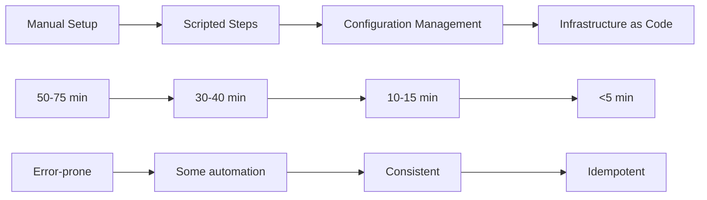
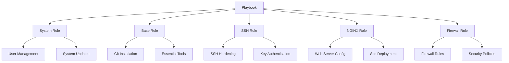
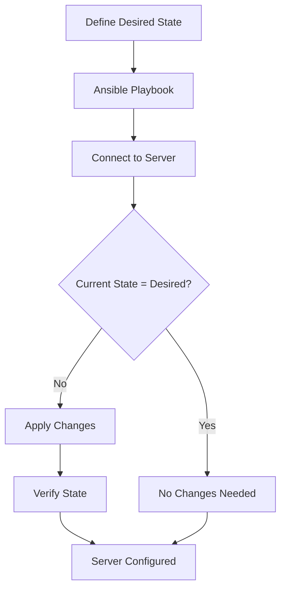
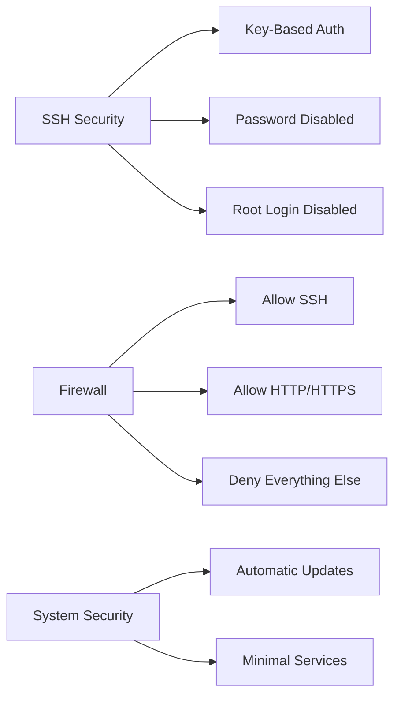

# V-Server Setup

Complete Ubuntu server configuration - from manual steps to Infrastructure as Code with Ansible.

import GithubLinkAdmonition from '@site/src/components/GithubLinkAdmonition';

<GithubLinkAdmonition 
    link="https://github.com/4gh0rn/v-server-setup"
    title="GitHub Repository" 
    type="tip"
>
View the complete source code and Ansible playbooks on GitHub
</GithubLinkAdmonition>

## Conceptual Overview

This project demonstrates the **evolution from manual to automated infrastructure management** - a journey that many DevOps teams undertake. It showcases how Infrastructure as Code (IaC) transforms server configuration from a manual, error-prone process into a repeatable, automated workflow.

### The Evolution Journey

The project follows a typical infrastructure automation evolution:



### Core Concepts

**Infrastructure as Code (IaC)** treats infrastructure configuration as software code:
- **Version Controlled**: All changes tracked in Git
- **Idempotent**: Running the same playbook multiple times produces the same result
- **Declarative**: Define desired state, not steps to achieve it
- **Testable**: Can validate configurations before applying

**Configuration Management** ensures servers maintain their intended state:
- **Desired State**: Define what the server should look like
- **Drift Detection**: Identify when servers deviate from desired state
- **Automated Remediation**: Automatically fix configuration drift

## The Challenge

### Manual Server Setup Problems

Setting up a new server manually involves:
- **Time-Consuming**: 50-75 minutes per server
- **Error-Prone**: Human mistakes in configuration
- **Inconsistent**: Each server ends up slightly different
- **Not Scalable**: Can't efficiently manage multiple servers
- **No Audit Trail**: Hard to track what was changed and why

### Configuration Drift

Without automation, servers experience **configuration drift**:
- Manual changes not documented
- Different versions of software
- Inconsistent security settings
- Unknown configuration state

## The Solution

### Infrastructure as Code Benefits

By implementing Infrastructure as Code with Ansible:

- **Reproducibility**: Same configuration across all servers
- **Speed**: Setup time reduced from 50-75 minutes to under 5 minutes
- **Consistency**: No human errors or configuration drift
- **Scalability**: Easy to deploy to multiple servers simultaneously
- **Version Control**: All changes tracked and auditable
- **Testing**: Validate configurations before applying

## Key Features

### Automated SSH Security
- Public key authentication setup
- Password authentication disabled
- Root login restrictions
- Secure SSH configuration

### NGINX Web Server
- Automated installation and configuration
- Custom site configuration
- Security headers implementation
- Alternative landing page deployment

### Infrastructure as Code
- Ansible playbooks for all configurations
- Role-based organization
- Environment-specific configurations
- Version-controlled infrastructure

## Technologies Used

- **Ansible**: Infrastructure automation
- **Linux**: Ubuntu server administration
- **NGINX**: Web server
- **SSH**: Secure remote access
- **Git**: Version control

## Architecture Concepts

### Role-Based Organization Pattern

The project uses **Ansible roles** to implement the **Single Responsibility Principle**:



### Configuration Management Workflow

The automation follows a **declarative workflow**:



### Security Hardening Concepts

The project implements **security hardening** through multiple layers:



## Design Patterns

### Idempotency Pattern

All Ansible tasks are **idempotent** - running the same playbook multiple times produces the same result:

```yaml
# This task is idempotent
- name: Ensure Nginx is installed
  apt:
    name: nginx
    state: present  # Only installs if not already installed
```

### Role-Based Modularity

Each role has a **single responsibility**:
- **System Role**: Only handles system-level configuration
- **SSH Role**: Only handles SSH security
- **NGINX Role**: Only handles web server configuration

This enables:
- **Reusability**: Roles can be used across different playbooks
- **Testability**: Each role can be tested independently
- **Maintainability**: Changes to one role don't affect others

## Quickstart

1. Create a SSH key pair on your local machine
2. Login via `ssh` using your username and designated password
3. Add your public SSH-Keys to the V-Servers `authorized_keys` with the following command:
   ```bash
   ssh-copy-id -i $HOME/.ssh/your-public-key.pub <user>@123.4.5.255
   ```
4. Logout from Server, try logging in with the KEY information only:
   ```bash
   ssh -i <path/to/key> user@host
   ```
   You should not be prompted for a password if it works correctly
5. Log in to the V-Server again
6. Disable Password-Login
7. Disable Root-Login

## Learning Outcomes

### Infrastructure as Code Concepts
- **Declarative Configuration**: Define desired state, not steps
- **Idempotency**: Safe to run playbooks multiple times
- **Version Control**: Track all infrastructure changes
- **Configuration Drift Prevention**: Automated enforcement of desired state

### Automation Patterns
- **Role-Based Organization**: Modular, reusable components
- **Playbook Structure**: Organizing automation tasks
- **Variable Management**: Using host_vars and group_vars
- **Conditional Logic**: When to apply certain configurations

### Security Concepts
- **Defense in Depth**: Multiple security layers
- **Principle of Least Privilege**: Minimal required access
- **Security Hardening**: Automated security best practices
- **Audit Trail**: Track all security-related changes

### Best Practices
- **Test Before Apply**: Use `--check` mode
- **Version Control Everything**: Keep all playbooks in Git
- **Documentation**: Document why, not just what
- **Incremental Adoption**: Start small, expand gradually

## Further References

- [Ansible Documentation](https://docs.ansible.com/)
- [SSH Security Best Practices](https://www.ssh.com/academy/ssh/security)
- [NGINX Configuration Guide](https://nginx.org/en/docs/)
