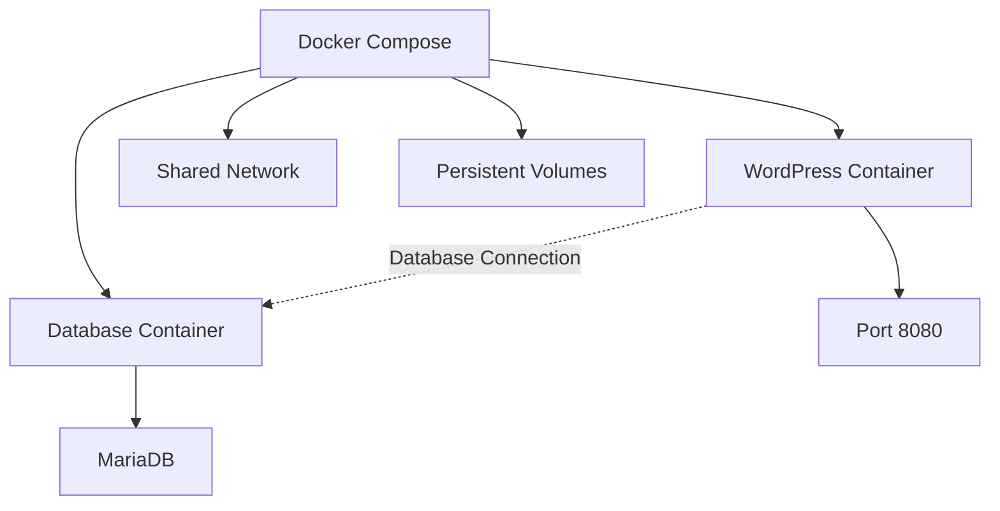
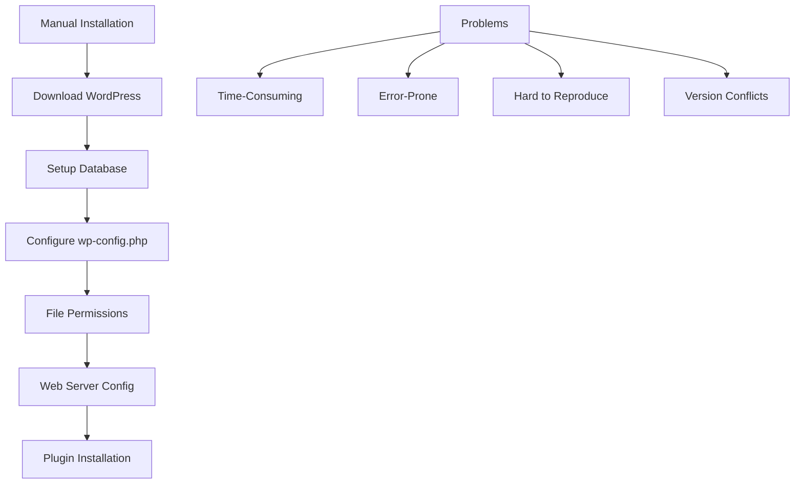
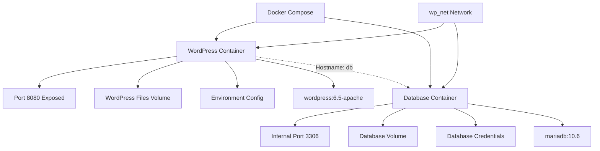
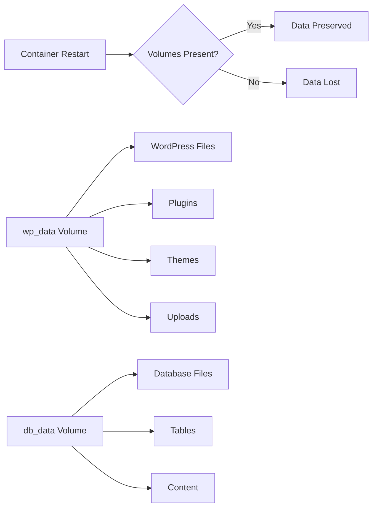
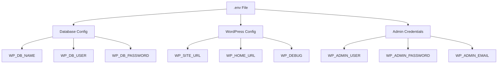
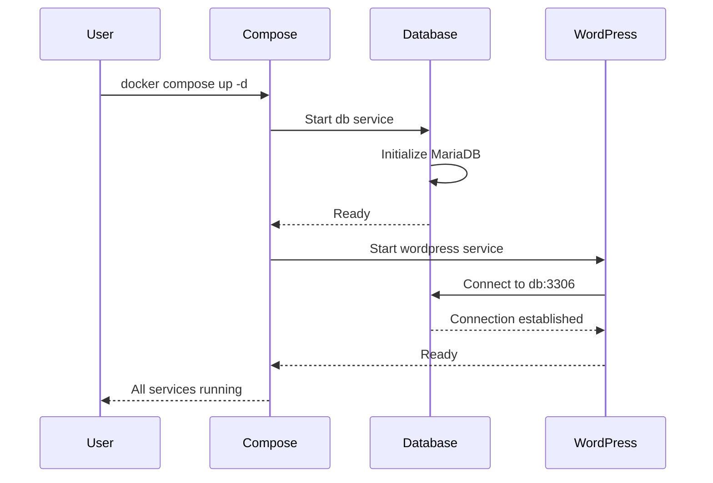
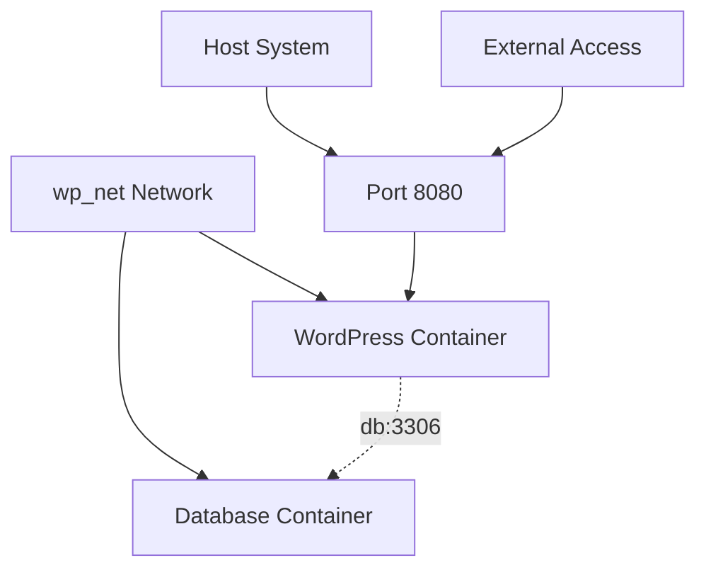
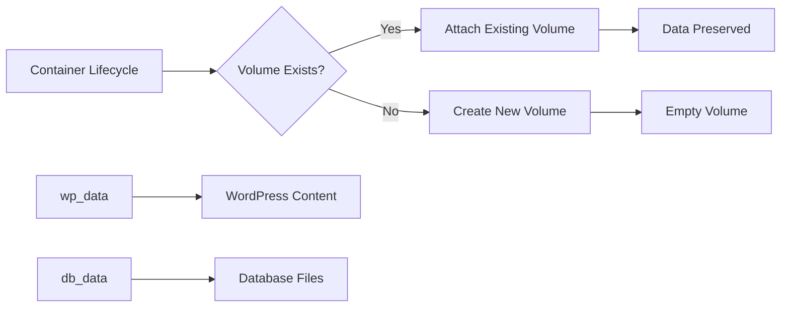

# WordPress Blog

Operate your first own blog website. Learn how to configure and operate your blog application quickly, securely, and simply, without lengthy manual installation. Reproduce the setup as often as needed with minimal adjustments.

import GithubLinkAdmonition from '@site/src/components/GithubLinkAdmonition';

<GithubLinkAdmonition 
    link="https://github.com/4gh0rn/wp-blog"
    title="GitHub Repository" 
    type="tip"
>
View the complete Docker Compose configuration and setup on GitHub
</GithubLinkAdmonition>

## Project Goal

**Operate your first own blog website** with a setup that is:
- **Quick**: No lengthy manual installation required
- **Secure**: Sensitive data managed through environment variables
- **Simple**: Easy configuration and operation
- **Reproducible**: Setup can be reproduced anywhere with minimal adjustments

Learn to use **Docker Compose** to orchestrate multi-container applications and understand how to create reproducible, maintainable infrastructure.

## Prerequisites

### Required Knowledge
- Basic understanding of web applications
- Familiarity with command line
- Basic knowledge of content management systems (helpful but not required)

### Required Software
- **Docker**: Containerization platform
- **Docker Compose**: Container orchestration tool
- **Git**: Version control

### System Requirements
- Operating system with Docker support
- Minimum 2GB RAM
- Port 8080 available
- Internet connection for downloading images

## Conceptual Overview

### What is Docker Compose?

Docker Compose orchestrates **multiple containers** as a single application:

**Benefits:**
- **Multi-Container Management**: Define and run multiple containers together
- **Service Dependencies**: Automatically start services in correct order
- **Network Isolation**: Containers communicate through defined networks
- **Volume Management**: Persistent data storage across restarts

### Core Concepts

**Service Orchestration** - Managing multiple containers:
- **WordPress Service**: Web application container
- **Database Service**: MariaDB database container
- **Service Dependencies**: WordPress waits for database to be ready
- **Restart Policies**: Automatic container restart on failure

**Persistent Storage** - Data survives container restarts:
- **Named Volumes**: Persistent storage for WordPress files and database
- **Data Persistence**: Posts, plugins, themes, and database survive restarts
- **Backup Capability**: Volumes can be backed up and restored
- **Migration Support**: Easy to move to different hosts

**Network Isolation** - Secure container communication:
- **Bridge Network**: Isolated network for containers
- **Service Discovery**: Containers find each other by service name
- **Security**: Network isolation prevents external access to database

**Environment Configuration** - Flexible setup:
- **Environment Variables**: All configuration via `.env` file
- **Default Values**: Safe defaults with `${VAR:-default}` syntax
- **Secret Management**: Passwords and credentials in `.env` (not in code)
- **Reproducibility**: Same setup with different configurations

## The Challenge

### Traditional WordPress Installation

Traditional WordPress setup faces challenges:

**Common Issues:**
- **Time-Consuming**: Manual installation takes 30-60 minutes
- **Error-Prone**: Multiple configuration steps, easy to make mistakes
- **Hard to Reproduce**: Different setup on each server
- **Version Conflicts**: PHP, MySQL, WordPress version compatibility
- **Migration Difficulties**: Hard to move to different server
- **Backup Complexity**: Manual backup procedures

## The Solution: Docker Compose

### Reproducible Setup

Docker Compose enables **reproducible WordPress deployment**:

**Benefits:**
- **One Command**: `docker compose up -d` deploys entire stack
- **Consistent**: Same setup on any Docker host
- **Fast**: Setup in minutes, not hours
- **Reproducible**: Exact same configuration every time

### Multi-Container Architecture

The setup uses **two containers** working together:

**Container Details:**
- **WordPress**: Official WordPress image (6.5-apache) running as `wp_blog_app`
- **Database**: MariaDB 10.6 running as `wp_blog_db`
- **Volumes**: `wp_data` for WordPress files, `db_data` for database
- **Network**: `wp_net` bridge network for service communication

**Service Communication:**
- WordPress connects to database using hostname `db`
- No need for IP addresses
- Automatic DNS resolution within network
- Secure internal communication

### Persistent Data Storage

**Named Volumes** ensure data persistence:

**Volume Benefits:**
- **Data Persistence**: Content survives container restarts
- **Backup Support**: Volumes can be backed up
- **Migration**: Easy to move volumes to different host
- **Isolation**: Data separated from container lifecycle

### Environment-Based Configuration

All configuration through **environment variables**:

**Configuration Benefits:**
- **No Hardcoded Secrets**: All sensitive data in `.env`
- **Git-Safe**: `.env` excluded from version control
- **Flexible**: Different configs for different environments
- **Reproducible**: Same setup with different values

## Architecture Concepts

### Service Dependencies

Docker Compose manages **service startup order**:

**Dependency Management:**
- `depends_on` ensures database starts before WordPress
- WordPress waits for database to be ready
- Automatic retry on connection failure

### Network Architecture

Containers communicate through **Docker bridge network**:

**Network Benefits:**
- **Isolation**: Containers isolated from host network
- **Service Discovery**: Containers find each other by name
- **Security**: Database not exposed to external network
- **Flexibility**: Easy to add more services

### Volume Management

**Named volumes** provide persistent storage:

**Volume Lifecycle:**
- Volumes created on first `docker compose up`
- Data persists across `docker compose down`
- Volumes removed only with `docker compose down -v`
- Easy backup: copy volume data

## Learning Outcomes

### Docker Compose Mastery
- **Multi-Container Orchestration**: Managing multiple services together
- **Service Dependencies**: Defining startup order and dependencies
- **Network Configuration**: Setting up container communication
- **Volume Management**: Persistent data storage

### Reproducibility
- **Infrastructure as Code**: Defining infrastructure in YAML
- **Version Control**: Tracking infrastructure changes
- **Environment Configuration**: Flexible setup with environment variables
- **Migration Support**: Easy to reproduce on different hosts

### WordPress Operations
- **Containerized WordPress**: Running WordPress in containers
- **Database Management**: MariaDB container configuration
- **Data Persistence**: Understanding volume-based storage
- **Backup Strategies**: Volume backup and restore

## Best Practices

### Security
- **Never commit `.env` files**: Use `.env.example` as template
- **Strong passwords**: Use secure passwords for database and admin
- **Network isolation**: Database not exposed externally
- **Regular updates**: Keep WordPress and MariaDB images updated

### Configuration
- **Environment variables**: All configuration via `.env`
- **Default values**: Use `${VAR:-default}` syntax for safe defaults
- **Documentation**: Document all configuration options
- **Validation**: Verify configuration before deployment

### Data Management
- **Volume backups**: Regular backup of volumes
- **Migration planning**: Document volume migration process
- **Data persistence**: Understand volume lifecycle
- **Cleanup strategy**: Know when to remove volumes

### Operations
- **Restart policies**: Use `restart: unless-stopped`
- **Health monitoring**: Monitor container health
- **Log management**: Centralize container logs
- **Update procedures**: Document upgrade process

## Troubleshooting

### Container Won't Start
- Check logs: `docker compose logs`
- Verify environment variables
- Check port availability (8080)
- Ensure Docker has sufficient resources

### Database Connection Issues
- Verify containers are in same network
- Check database hostname (use service name `db`)
- Verify database credentials in `.env`
- Check database container logs

### Data Not Persisting
- Verify volumes are created: `docker volume ls`
- Check volume mounts in `compose.yml`
- Ensure volumes not removed with `-v` flag
- Verify volume permissions

### Port Already in Use
- Change port mapping in `compose.yml`: `"8081:80"`
- Find process using port: `lsof -i :8080`
- Stop conflicting service
- Use different port for WordPress

## Further References

- [Docker Compose Documentation](https://docs.docker.com/compose/)
- [WordPress Docker Image](https://hub.docker.com/_/wordpress)
- [MariaDB Docker Image](https://hub.docker.com/_/mariadb)
- [WordPress Documentation](https://wordpress.org/documentation/)
